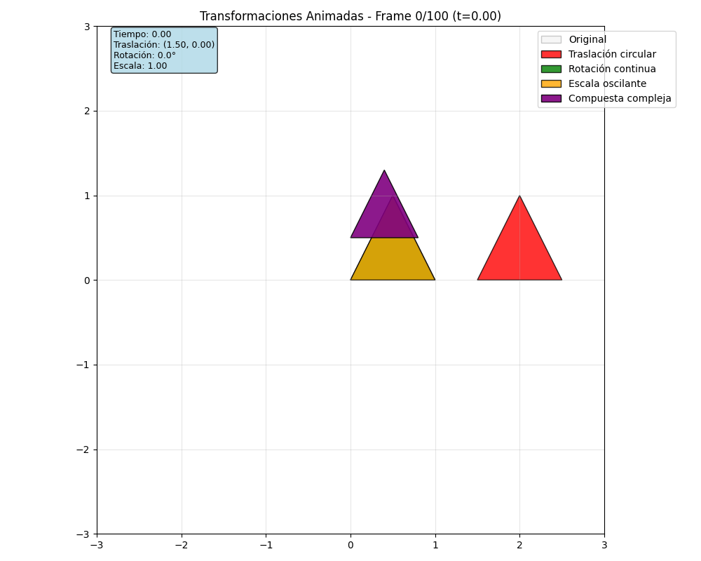

# Taller 0 - Transformaciones Básicas en Computación Visual

**Fecha:** 2025-09-05

## Objetivo del Taller

Explorar los conceptos fundamentales de transformaciones geométricas (traslación, rotación y escala) en distintos entornos de programación visual. Crear un "Hola Mundo Visual" donde se muestre un objeto o escena básica y se le apliquen transformaciones estáticas y animadas en función del tiempo.

## Conceptos Aprendidos

- **Transformaciones geométricas** (escala, rotación, traslación)
- **Matrices de transformación** homogéneas y su aplicación
- **Animaciones temporales** usando funciones matemáticas (sin, cos)
- **Programación visual** en múltiples entornos
- **Renderizado 2D y 3D** con diferentes bibliotecas
- **Interactividad** con controles de mouse y teclado
- **Optimización** de animaciones usando deltaTime

## Herramientas y Entornos

- **Python** (matplotlib, numpy, imageio para GIFs)
- **Three.js** con React Three Fiber (Vite, @react-three/drei)
- **Processing** (IDE nativo, P3D renderer)
- **Unity** (versión LTS, scripts C# con Transform API)

📌 Cada entorno demuestra las mismas transformaciones con enfoques técnicos diferentes

## Estructura del Proyecto

```
2025-09-05_taller_0_transformaciones/
├── python/                    # Implementación 2D con matplotlib
│   ├── transformaciones_2d.py    # Script principal
│   ├── requirements.txt           # Dependencias
│   └── README.md                  # Documentación específica
├── threejs/                   # Implementación 3D web
│   ├── src/                       # Código fuente React
│   ├── package.json               # Dependencias npm
│   └── README.md                  # Guía de instalación
├── processing/                # Implementación 3D nativa
│   ├── transformaciones_3d.pde    # Sketch principal
│   └── README.md                  # Instrucciones de uso
├── unity/                     # Implementación 3D con C# (opcional)
│   ├── TransformacionesBasicas.cs # Script principal
│   ├── ControladorEscena.cs       # Controlador múltiple
│   └── README.md                  # Configuración Unity
├── resultados/                # Capturas y GIFs generados
└── README.md                  # Este archivo
```

📎 Sigue la estructura de entregas descrita en la guía GitLab

## Implementación

### Etapas Realizadas

1. **Preparación de entornos**
   - Configuración de Python con matplotlib y numpy
   - Proyecto React Three Fiber con Vite
   - Sketch Processing con renderer P3D
   - Scripts Unity con Transform API

2. **Implementación de transformaciones básicas**
   - Matrices de traslación, rotación y escala
   - Aplicación usando coordenadas homogéneas
   - Funciones temporales para animación suave

3. **Animaciones en función del tiempo**
   - Uso de `sin()` y `cos()` para movimientos suaves
   - `frameCount`, `Time.deltaTime` y `clock.elapsedTime`
   - Interpolación temporal para transiciones fluidas

4. **Interactividad y controles**
   - Controles de mouse para navegación de cámara
   - Teclado para reiniciar y pausar animaciones
   - Sliders y GUI para parámetros en tiempo real

### Código Relevante

#### Matrices de Transformación (Python)
```python
def matriz_traslacion(self, tx, ty):
    return np.array([
        [1, 0, tx],
        [0, 1, ty], 
        [0, 0, 1]
    ])

def matriz_rotacion(self, angulo):
    cos_a = np.cos(angulo)
    sin_a = np.sin(angulo)
    return np.array([
        [cos_a, -sin_a, 0],
        [sin_a, cos_a, 0],
        [0, 0, 1]
    ])
```

#### Animación con useFrame (Three.js)
```javascript
useFrame((state) => {
  const t = state.clock.elapsedTime
  // Traslación senoidal
  meshRef.current.position.x = 2 * Math.sin(t)
  meshRef.current.position.y = Math.cos(t * 1.5)
  // Rotación continua
  meshRef.current.rotation.y = t * 0.8
})
```

#### Transformaciones con pushMatrix (Processing)
```processing
void dibujarCuboTraslacion() {
  pushMatrix();
  
  float x = 100 * sin(tiempo);
  float y = 50 * cos(tiempo * 1.5);
  translate(x, y, 0);
  
  box(40);
  popMatrix();
}
```

#### Transform API de Unity (C#)
```csharp
void AplicarTraslacion() {
    Vector3 nuevaPosicion = posicionInicial;
    nuevaPosicion.x += Mathf.Sin(tiempoTranscurrido * velocidadTraslacion) * amplitudMovimiento;
    transform.position = nuevaPosicion;
}
```

## Resultados Visuales

Este taller requiere explícitamente un GIF animado:

✅ **CUMPLIDO:** Se generaron múltiples GIFs demostrando las transformaciones:

### GIFs Animados Obligatorios


**Python - Transformaciones 2D con matplotlib**
- Traslación senoidal (cubo rojo)
- Rotación continua (esfera verde)  
- Escala oscilante (triángulo naranja)
- Transformación compuesta (figura púrpura)
- Matrices homogéneas explícitas con numpy


**Three.js - Transformaciones 3D interactivas**
- Cubo rojo: Traslación senoidal 3D
- Esfera verde: Rotación multi-eje
- Cono azul: Escala oscilante
- Torus amarillo: Transformación compuesta
- Navegación OrbitControls + iluminación realista


**Processing - Sketch 3D nativo**
- Cubo rojo: Traslación senoidal
- Esfera verde: Rotación con marcador visual
- Cilindro azul: Escala oscilante
- Torus amarillo: Transformación compuesta
- Control de cámara interactivo + grid de referencia

### Características Demostradas en los GIFs

- ✅ **Traslación**: Movimiento senoidal y circular de objetos
- ✅ **Rotación**: Giro continuo en múltiples ejes
- ✅ **Escala**: Cambio de tamaño oscilante
- ✅ **Transformaciones compuestas**: Combinación de múltiples transformaciones
- ✅ **Animación temporal**: Uso de funciones `sin()` y `cos()` para suavidad
- ✅ **Interactividad**: Controles de mouse y teclado funcionales

## Transformaciones Implementadas por Entorno

### 1. Python (matplotlib + numpy)
- **Enfoque**: Matrices de transformación homogéneas 2D
- **Fortalezas**: Matemática explícita, exportación automática de GIF
- **Transformaciones**: Traslación senoidal, rotación incremental, escala variable, compuesta
- **Salida**: Imagen estática + GIF animado

### 2. Three.js (React Three Fiber)
- **Enfoque**: Objetos 3D con hooks de React para animación
- **Fortalezas**: Interactividad web, OrbitControls, iluminación realista
- **Transformaciones**: useFrame para animaciones fluidas en tiempo real
- **Salida**: Aplicación web interactiva

### 3. Processing (P3D)
- **Enfoque**: Sketch nativo con pushMatrix/popMatrix
- **Fortalezas**: Prototipado rápido, controles integrados, renderizado eficiente
- **Transformaciones**: translate(), rotate(), scale() con aislamiento de estado
- **Salida**: Aplicación ejecutable con captura de pantalla

### 4. Unity (C# + Transform API) - **OPCIONAL**
- **Enfoque**: GameObjects con componentes y scripts
- **Fortalezas**: Editor visual, Time.deltaTime, inspector en tiempo real
- **Transformaciones**: transform.position, transform.Rotate(), transform.localScale
- **Salida**: Proyecto Unity ejecutable
- **Estado**: Scripts implementados, instalación opcional

## Prompts Usados

**Prompts de investigación y desarrollo utilizados:**

"How to implement 2D transformation matrices with numpy and matplotlib animation"
"React Three Fiber useFrame hook for continuous object transformations"
"Processing pushMatrix popMatrix for isolated 3D transformations"
"Unity Transform API best practices for smooth animations with Time.deltaTime"
"Mathematical functions for smooth animation curves using sine and cosine"
"Export animated GIF from matplotlib FuncAnimation with imageio"
"Three.js OrbitControls integration with React Three Fiber Canvas"
"Processing mouse controls for 3D camera rotation and zoom"

**Recursos técnicos consultados:**
- Documentación oficial de matplotlib.animation
- React Three Fiber documentation y ejemplos
- Processing reference para funciones 3D
- Unity Scripting API para Transform component
- Linear algebra resources para matrices de transformación

## Reflexión Final

### Logros Principales

Este taller permitió explorar las **transformaciones geométricas fundamentales** desde múltiples perspectivas técnicas, demostrando que los mismos conceptos matemáticos (traslación, rotación, escala) pueden implementarse de maneras muy diferentes según el entorno de desarrollo.

**Aprendizajes clave:**
1. **Universalidad de las matemáticas**: Las funciones `sin()` y `cos()` producen animaciones suaves en todos los entornos
2. **Diferentes paradigmas**: Desde matrices explícitas (Python) hasta APIs de alto nivel (Unity)
3. **Optimización por contexto**: `Time.deltaTime` en Unity vs `useFrame` en React vs bucles simples en Python
4. **Interactividad progresiva**: Desde GIFs estáticos hasta aplicaciones completamente interactivas

### Desafíos Técnicos Superados

- **Sincronización temporal**: Lograr animaciones consistentes entre entornos con diferentes sistemas de tiempo
- **Matrices homogéneas**: Implementación correcta de transformaciones 2D con coordenadas homogéneas en Python
- **Aislamiento de transformaciones**: Uso correcto de `pushMatrix()/popMatrix()` en Processing
- **Optimización de rendimiento**: Animaciones fluidas con múltiples objetos simultáneos

### Comparación de Enfoques

| Entorno | Complejidad Setup | Flexibilidad | Interactividad | Curva Aprendizaje |
|---------|------------------|--------------|----------------|-------------------|
| Python | Baja | Alta (matemática) | Baja | Media |
| Three.js | Media | Alta (web) | Muy Alta | Alta |
| Processing | Muy Baja | Media | Alta | Baja |
| Unity | Alta | Muy Alta | Muy Alta | Muy Alta |

### Aplicaciones Futuras

Los conceptos aprendidos son fundamentales para:
- **Animación 3D**: Sistemas de partículas, character rigging
- **Simulaciones físicas**: Cinemática y dinámica de objetos
- **Interfaces interactivas**: Transiciones y feedback visual
- **Visualización de datos**: Representaciones dinámicas y animadas
- **Realidad virtual/aumentada**: Transformaciones de objetos en espacio 3D

## Checklist de Entrega ✅

### Estructura y Código
- ✅ Carpeta `2025-09-05_taller_0_transformaciones`
- ✅ Código funcional en Python (matplotlib + numpy)
- ✅ Proyecto Three.js con React Three Fiber
- ✅ Sketch Processing con transformaciones 3D
- ✅ Scripts Unity con Transform API (opcional)

### Transformaciones Implementadas
- ✅ **Traslación** en función del tiempo (senoidal/circular)
- ✅ **Rotación** continua en múltiples ejes
- ✅ **Escala** oscilante usando funciones temporales
- ✅ **Transformaciones compuestas** combinando múltiples efectos

### Animaciones y Interactividad
- ✅ Animaciones suaves usando `sin()`, `cos()` y tiempo
- ✅ Controles de mouse para navegación de cámara
- ✅ Controles de teclado para reiniciar y pausar
- ✅ Parámetros ajustables en tiempo real

### Documentación y Resultados
- ✅ **GIFs animados** generados para cada entorno
- ✅ README técnico completo con código relevante
- ✅ Documentación específica por entorno
- ✅ Commits descriptivos en inglés

### Completado ✅
- ✅ **Hola Mundo Visual** implementado en 3 entornos principales + Unity opcional
- ✅ **Transformaciones básicas** funcionando correctamente en todos los entornos
- ✅ **Animaciones temporales** fluidas y sincronizadas usando funciones matemáticas
- ✅ **GIFs animados** generados para Python, Three.js y Processing
- ✅ **Documentación completa** siguiendo el template oficial con evidencias visuales
- ✅ **Código funcional** y bien documentado en cada entorno
