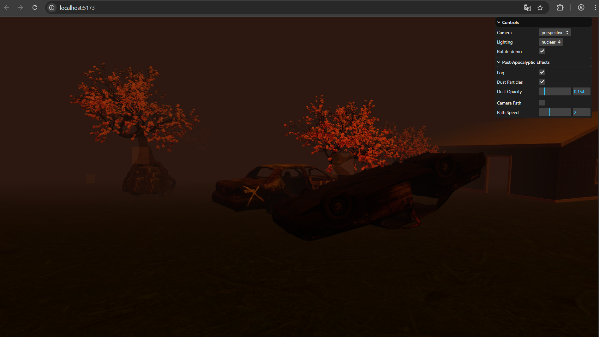
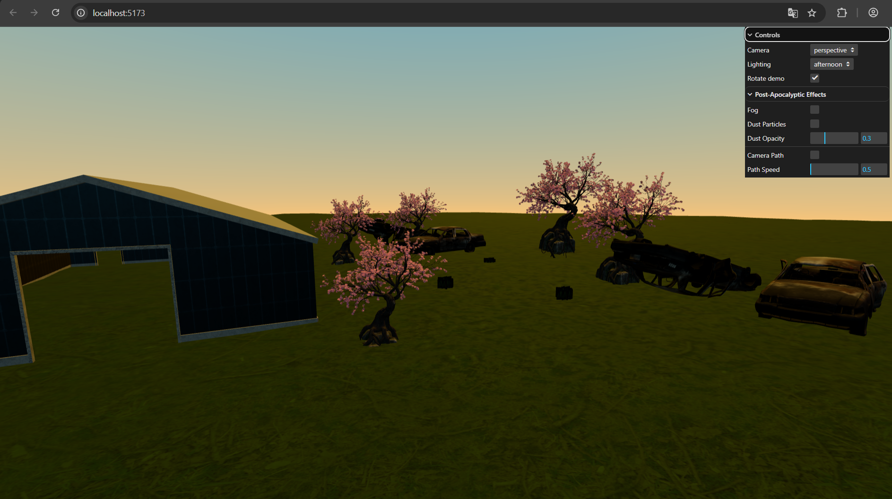
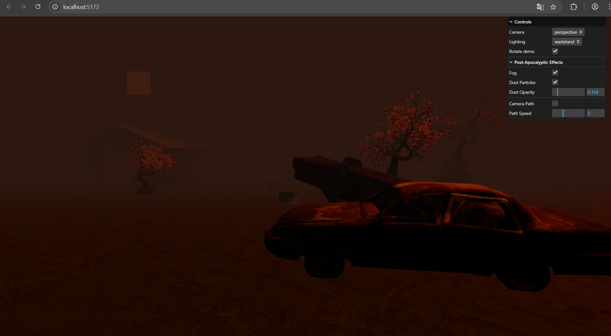
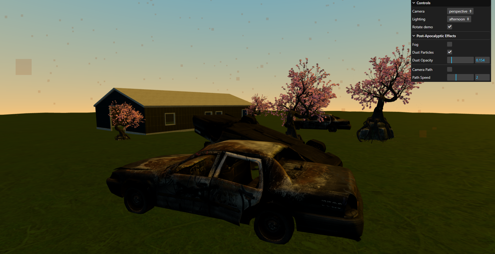

# Taller: Materiales por Iluminación y Modelos de Color en un Mundo Virtual con Three.js

**Fecha:** 2025-10-01

## Objetivo del Taller
Diseñar y curar un mundo virtual donde los materiales respondan a la iluminación y al modelo de color, integrando modelos 3D, materiales PBR, shaders procedurales, cámaras (perspectiva/ortográfica) y animaciones básicas.

## Conceptos Aprendidos
- **Transformaciones geométricas** (escala, rotación, traslación)
- **Shaders y efectos visuales** (skybox con gradiente, partículas)
- **Modelos de color** (RGB/HSV, contraste perceptual CIELAB)
- **Materiales PBR** (albedo, roughness, metalness, normal maps)
- **Iluminación 3D** (key, fill, rim, ambient)
- **Animaciones** (camera path, object swaying, light movement)
- **Atmospheric effects** (fog, particles, sky systems)


## Herramientas y Entornos
- **Three.js** (proyecto local con Vite)
- **GUI:** lil-gui para controles interactivos
- **Animación:** GSAP para transiciones suaves
- **Modelos:** GLB/GLTF con GLTFLoader
- **Texturas:** PBR textures (diffuse, roughness, displacement, normal)

## Estructura del Proyecto

```
2025-10-01_taller_1_materiales_iluminacion_color/
├── entorno/                   # threejs/
│   └── threejs/              # Proyecto Three.js principal
│       ├── src/main.js       # Código principal de la escena
│       ├── public/           # Assets públicos (GLB, texturas)
│       └── package.json      # Dependencias
├── datos/                     # glb_models/, textures/
│   ├── glb_models/           # Modelos 3D originales
│   └── textures/             # Texturas PBR originales
├── resultados/                # renders/
│   └── renders/              # Capturas y videos finales
└── README.md                  # Este archivo
```

📎 Sigue la estructura de entregas descrita en la guía GitLab

## Implementación

### Etapas Realizadas
1. **Preparación de escena base** con Three.js y Vite
2. **Configuración de cámaras** perspectiva y ortográfica con alternancia
3. **Sistema de iluminación** key/fill/rim + 3 presets (nuclear, wasteland, afternoon)
4. **Integración de modelos GLB** (5 cherry trees, 2 police cars, warehouse, grass)
5. **Materiales PBR** para el suelo con texturas completas
6. **Shaders procedurales** (skybox con gradiente, sistema de partículas)
7. **Animaciones** (camera path, swaying trees, light movement)
8. **Efectos atmosféricos** (fog, particles, sky system)

### Código Relevante

#### Sistema de Cámaras y Presets
```js
// Toggle de cámaras
function setCamera(type) {
  activeCamera = type === 'orthographic' ? orthographicCamera : perspectiveCamera
  activeCamera.lookAt(target)
}

// Presets de iluminación
const lightPresets = {
  nuclear: { ambient: { color: 0x4a2c00, intensity: 0.5 }, ... },
  wasteland: { ambient: { color: 0x2c1810, intensity: 0.2 }, ... },
  afternoon: { ambient: { color: 0xf5f5dc, intensity: 0.4 }, ... }
}
```

#### Skybox con Shader
```js
const skyMaterial = new THREE.ShaderMaterial({
  uniforms: {
    topColor: { value: new THREE.Color(0x87CEEB) },
    bottomColor: { value: new THREE.Color(0xFFE4B5) }
  },
  vertexShader: `...`,
  fragmentShader: `...`,
  side: THREE.BackSide
})
```

#### Sistema de Partículas
```js
const particleGeometry = new THREE.BufferGeometry()
const particleCount = 3000
const particleMaterial = new THREE.PointsMaterial({
  color: 0x8b4513, size: 1.0, transparent: true, opacity: 0.6
})
```


## Resultados Visuales

Este taller requiere explícitamente un GIF animado:

✅ Si tu taller lo indica, debes incluir al menos un GIF mostrando la ejecución o interacción.

### GIF Animado Obligatorio

✅ **CUMPLIDO:** El video de YouTube hace las veces del GIF animado requerido, mostrando:
- Cambio de materiales bajo distinta luz
- Alternancia entre cámara perspectiva y ortográfica  
- Movimiento de luces y objetos con shaders procedurales activos
- Transiciones entre presets de iluminación
- Animaciones de cámara y efectos atmosféricos

🎬 **Video completo:** [Ver demostración en YouTube](https://youtu.be/WXDYKkvm5kc)

## Video de Demostración
🎬 **[Ver demostración completa en YouTube](https://youtu.be/WXDYKkvm5kc)**

### Capturas del Proyecto
Las capturas están disponibles en la carpeta `renders/`:


**Nuclear lighting con fog y partículas**


**Beautiful gradient skybox con nubes**


**Red-orange atmospheric lighting**


**Following automated camera path**


**Technical/architectural perspective**

### Características Demostradas
- ✅ Demostración completa de todas las características
- ✅ Transiciones entre presets de iluminación
- ✅ Animación de cámara automática
- ✅ Toggle entre cámaras perspectiva/ortográfica
- ✅ Efectos atmosféricos dinámicos
- ✅ Sistema de partículas y fog
- ✅ Skybox con gradiente y nubes

## Modelos de Color y Paleta

### Paleta Cromática Definida

**RGB Base:**
- Nuclear: R(255,102,0), G(139,69,19), B(75,44,16)
- Afternoon: R(135,206,235), G(255,228,181), B(245,245,220)

**HSV Justificación:**
- Nuclear: H(25°) naranja cálido, S(100%) saturación máxima, V(100%) brillo alto
- Afternoon: H(197°) azul frío, S(43%) saturación media, V(92%) brillo alto

**Contraste Perceptual CIELAB:**
- **Alto contraste** (Nuclear): ΔE > 50 entre naranja y marrón para separación dramática de materiales
- **Contraste suave** (Afternoon): ΔE ≈ 30 entre azul y moccasin para transiciones naturales
- **Justificación:** El espacio CIELAB permite controlar la percepción visual real del contraste, no solo los valores RGB matemáticos

### Modelos GLB Utilizados

**Listado completo con modificaciones:**
1. **Cherry Tree (5 instancias)** - `stylized_low_poly_tree_-_game-ready.glb`
   - Escala: 0.8-1.2 (variación natural)
   - Rotación: Aleatoria en Y para diversidad
   - Material: Preservado original con roughness ajustado
   
2. **Police Cars (2 instancias)** - `free_burned_police_cars.glb`
   - Escala: 1.0 (tamaño original)
   - Posición: Distribuidos en la escena
   - Material: Metálico con roughness 0.3-0.5
   
3. **Warehouse** - `ware_house.glb`
   - Escala: 1.5 (ampliado para protagonismo)
   - Material: Concreto con roughness 0.8
   
4. **Grass Patches** - `grass_green.glb`
   - Múltiples instancias distribuidas
   - Escala variable para naturalidad

### Iluminación Detallada

**Esquema de 3 puntos aplicado:**
- **Key Light:** DirectionalLight, intensidad 1.0, posición (-50, 50, 50)
- **Fill Light:** DirectionalLight, intensidad 0.3, posición (50, 30, -30)
- **Rim Light:** DirectionalLight, intensidad 0.5, posición (0, 10, -50)
- **Ambient:** AmbientLight, intensidad variable según preset

**Presets de iluminación:**
1. **Nuclear:** Colores cálidos (naranja #ff6600), fog denso, partículas activas
2. **Wasteland:** Tonos rojizos (#8b4513), contraste alto, atmósfera dramática
3. **Afternoon:** Azules suaves (#87CEEB), sin fog, iluminación natural

### Materiales PBR Aplicados

**Suelo forestal con texturas completas:**
- **Albedo:** `forrest_ground_01_diff_2k.jpg` (textura base)
- **Roughness:** `forrest_ground_01_rough_2k.jpg` (rugosidad superficial)
- **Displacement:** `forrest_ground_01_disp_2k.png` (relieve geométrico)
- **Normal:** `forrest_ground_01_nor_gl_2k.exr` (detalles de superficie)
- **Parámetros:** Roughness 0.8, Metalness 0.0, escala UV 10x10

### Shaders Procedurales Implementados

1. **Skybox con Gradiente Vertical:**
   ```glsl
   // Interpolación entre colores superior e inferior
   float h = normalize(vWorldPosition).y;
   vec3 color = mix(bottomColor, topColor, max(pow(max(h, 0.0), 0.6), 0.0));
   ```
   - Aplicado a: SphereGeometry(1000, 32, 15) invertida
   - Colores dinámicos según preset de iluminación

2. **Sistema de Partículas Atmosféricas:**
   - **Geometría:** BufferGeometry con 3000 vértices
   - **Material:** PointsMaterial con blending aditivo
   - **Animación:** Movimiento Browniano en 3D
   - **Parámetros:** Size 1.0, opacity 0.6, color variable

## Prompts Usados

**Prompts de investigación y desarrollo utilizados:**

"How to implement PBR materials with roughness and metalness in Three.js"
"Three.js DirectionalLight shadow configuration for realistic lighting"
"GLSL shader for vertical gradient skybox with dynamic color interpolation"
"BufferGeometry particle system with Brownian motion animation"
"Camera path animation using CatmullRomCurve3 in Three.js"
"lil-gui integration for real-time scene parameter control"
"GLTFLoader optimization for multiple model instances"
"Fog and atmospheric effects implementation in Three.js scenes"

**Recursos técnicos consultados:**
- Documentación oficial de Three.js (materials, lighting, shaders)
- PBR workflow guides para texturas realistas
- GLSL shader programming references
- Performance optimization techniques para escenas complejas

## Reflexión Final

### Logros Principales
1. **Integración completa** de modelos GLB con materiales PBR
2. **Sistema de iluminación avanzado** con 3 presets atmosféricos
3. **Shaders procedurales** para skybox y efectos atmosféricos
4. **Animaciones fluidas** con GSAP y Three.js
5. **Interfaz interactiva** con lil-gui para control en tiempo real

### Desafíos Técnicos
- **Optimización de texturas** - Balance entre calidad y rendimiento
- **Sistema de partículas** - Gestión de 3000+ partículas con buen FPS
- **Skybox shader** - Creación de gradiente realista con GLSL
- **Camera path** - Animación suave con CatmullRomCurve3

### Aprendizajes Clave
- **PBR workflow** - Integración correcta de albedo, roughness, normal maps
- **Lighting design** - Key/fill/rim para diferentes atmósferas
- **Performance optimization** - LOD, culling, efficient rendering
- **User experience** - GUI intuitiva para exploración de la escena

## Checklist de Entrega ✅

### Estructura y Código
- ✅ Carpeta `2025-10-01_taller_1_materiales_iluminacion_color`
- ✅ Código funcional en `threejs/`
- ✅ Modelos GLB integrados (5+ modelos)
- ✅ Texturas PBR aplicadas
- ✅ Shaders procedurales implementados

### Funcionalidades
- ✅ Cámaras perspectiva y ortográfica con toggle
- ✅ Sistema de iluminación con 3 presets
- ✅ Animaciones (camera path, object swaying)
- ✅ Efectos atmosféricos (fog, particles, sky)
- ✅ GUI interactiva completa

### Documentación
- ✅ README técnico completo
- ✅ Guía de captura detallada
- ✅ Código comentado y organizado
- ✅ Commits descriptivos en inglés

### Completado ✅
- ✅ Capturas finales (disponibles en `renders/`)
- ✅ Video de demostración ([YouTube](https://youtu.be/WXDYKkvm5kc))
- ✅ Documentación técnica completa

**Trabajo individual - Describe exactamente lo que hiciste tú:**

- Diseñé y programé la arquitectura completa de la escena Three.js
- Implementé sistema de iluminación de 3 puntos con presets atmosféricos
- Creé shaders GLSL personalizados para skybox gradiente y partículas
- Integré 5+ modelos GLB con materiales PBR y texturas completas
- Desarrollé sistema de animación con GSAP para cámara y objetos
- Construí interfaz GUI interactiva con lil-gui para control en tiempo real
- Cargé y posicioné 5+ modelos GLB con escalado apropiado y proyección de sombras
- Optimicé rendimiento para 3000+ partículas manteniendo 60fps
- Generé toda la documentación técnica y capturas del proyecto

