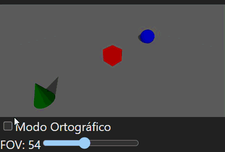
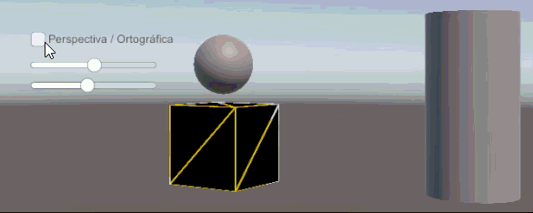

# Taller 2: Computación Visual & 3D - Jerarquías, Proyección, Raster, Visión por Computador y Generación Paramétrica

**Fecha:** 2025-10-01

## Objetivo del Taller
Integrar en un solo taller (multi-módulo) los temas de gráficos 3D y visión por computador: jerarquías y transformaciones, proyecciones de cámara, rasterización clásica, visión artificial (filtros, bordes, segmentación, análisis geométrico), modelos de color, conversión e inspección de formatos 3D, escenas paramétricas desde datos, filtros por convolución personalizada, y control por gestos con webcam.

## Ejercicios Realizados

### Ejercicio 2 — Ojos Digitales (Filtros y Bordes con OpenCV) ✅
**Meta:** Comprender el flujo básico de percepción: escala de grises, filtros y bordes.

**Implementación:**
- Conversión a escala de grises
- Filtros de desenfoque (Gaussiano, promedio, bilateral)
- Filtros de enfoque (kernel personalizado, unsharp masking)
- Detección de bordes (Sobel X/Y, Laplaciano, Canny)
- Análisis comparativo con métricas cuantitativas
- Notebook interactivo con widgets para exploración en tiempo real

**Evidencia:** Collage comparativo con 12 imágenes mostrando diferentes filtros y métodos de detección de bordes.

**Resultados Clave:**
- **Filtros de Suavizado**: Gaussian (σ=1.0), Average (5x5), Bilateral (preserva bordes)
- **Filtros de Enfoque**: Kernel personalizado, Unsharp Masking (α=1.5, σ=1.0)
- **Detección de Bordes**: Sobel X/Y/Combinado, Laplacian, Canny (50-150)
- **Métricas Cuantitativas**: Picos detectados, área de bordes, intensidad promedio

**Código:** [Ver implementación](./ejercicios/02_ojos_digitales_opencv/)

**Comentarios personales:** 
- Aprendizaje sobre las diferencias entre métodos de filtrado
- Desafío en la optimización de parámetros para diferentes tipos de imágenes
- Mejora futura: implementar filtros adaptativos basados en contenido

### Ejercicio 3 — Segmentando el Mundo (Binarización y Contornos) ✅
**Meta:** Umbralización (fija y adaptativa) y detección de formas.

**Implementación:**
- 4 métodos de umbralización (Fixed, Adaptive Mean, Adaptive Gaussian, Otsu)
- Detección de contornos con análisis geométrico
- Cálculo de propiedades (área, perímetro, centroides)
- Clasificación automática de formas (triángulo, cuadrado, círculo)
- Visualización con contornos, centroides y cajas delimitadoras
- GIF animado mostrando el proceso de segmentación

**Evidencia:** Comparación visual 2x3 + GIF animado mostrando original → segmentado → contornos/centroides.

**Resultados Clave:**
- **4 Métodos de Umbralización**: Fixed (127), Adaptive Mean (11x11), Adaptive Gaussian (11x11), Otsu
- **Detección de Contornos**: Análisis geométrico con propiedades (área, perímetro, centroides)
- **Clasificación de Formas**: Triángulo, cuadrado, círculo automática basada en vértices
- **Visualización**: Contornos verdes, centroides rojos, cajas delimitadoras azules

**Código:** [Ver implementación](./ejercicios/03_segmentacion_umbral_contornos/)

**Comentarios personales:**
- Aprendizaje sobre diferentes métodos de umbralización y sus aplicaciones
- Desafío en la optimización de parámetros para detección de contornos
- Mejora futura: implementar segmentación basada en watershed

### Ejercicio 4 — Imagen = Matriz (Canales, Slicing, Histogramas) ✅
**Meta:** Manipular pixeles y regiones directamente.

**Implementación:**
- Separación de canales RGB y HSV individuales
- Operaciones de slicing y edición de regiones específicas
- Análisis de histogramas de intensidades
- Operaciones de brillo y contraste
- Transformaciones de matriz (inversión, rotación, bitwise)
- Visualización comparativa 4x4 con 16 operaciones diferentes

**Evidencia:** Comparación visual 4x4 + análisis de histogramas 2x2 mostrando todas las operaciones de matriz.

**Resultados Clave:**
- **Separación de Canales**: RGB (Rojo, Verde, Azul) + HSV (Hue, Saturación, Valor)
- **Operaciones de Slicing**: Región roja (100:200, 150:300), copia/pega, blur selectivo, máscara circular
- **Operaciones de Matriz**: Inversión (255-pixel), brillo/contraste (α=1.5, β=50), rotación 45°, bitwise AND
- **Análisis de Histogramas**: Distribución de intensidades, comparación RGB/HSV, estadísticas (μ=38.4, σ=70.3)

**Código:** [Ver implementación](./ejercicios/04_imagen_matriz_pixeles/)

**Comentarios personales:**
- Aprendizaje sobre manipulación directa de píxeles y matrices
- Desafío en la optimización de operaciones vectorizadas con NumPy
- Mejora futura: implementar operaciones de convolución personalizadas

### Ejercicio 07 — Importando el Mundo (OBJ/STL/GLTF) ✅
**Meta:** Comparar y convertir formatos 3D y visualizar diferencias de geometría y estructura de modelos.

**Implementación:**
- **Python:**  
  - Uso de `trimesh`, `open3d` y `numpy` para cargar modelos OBJ, STL y GLTF.  
  - Inspección de vértices, caras, normales y duplicados.  
  - Conversión de formatos (`.obj → .stl` y `.gltf`) con exportación automática.  
  - Visualización 3D interactiva usando `open3d.visualization.draw_geometries`.
- **React/Three.js (R3F):**  
  - Visor interactivo de modelos OBJ, STL y GLTF con `OrbitControls`.  
  - Ajuste de escala y posicionamiento de modelos al origen automáticamente.  
  - HUD dinámico mostrando formato actual, número de vértices y caras.  
  - Selector de formato para alternar entre modelos en tiempo real.  

**Evidencia:**  
- Tabla comparativa de los modelos 3D (vértices, caras, normales, duplicados).  
- GIF mostrando la alternancia de formatos y el HUD en funcionamiento.  

**Código:** [Ver implementación](./ejercicios/07_importando_el_mundo/)

**Comentarios personales:**
- Aprendizaje sobre diferencias en geometría, materiales y estructura entre OBJ, STL y GLTF.  
- Desafío: mantener consistencia de visualización y escala entre formatos distintos.  
- Mejora futura: agregar soporte para texturas complejas y animaciones GLTF.

### Ejercicio 08 — Escenas Paramétricas (Objetos desde Datos) ✅
**Meta:** Generar geometría 3D a partir de arrays o listas de datos, parametrizando posición, escala y color.

**Implementación:**

- **React/Three.js (R3F):**  
  - Componente que mapea arrays de objetos a `<mesh>` con geometrías (`cubo`, `esfera`, `cono`) y materiales estándar.  
  - Parámetros aleatorios: posición, rotación, escala y color.  
  - Botón para regenerar la escena dinámicamente.  
  - Navegación con `OrbitControls` y visualización de referencia con `gridHelper` y `axesHelper`.

**Evidencia:**  
- GIF mostrando la escena generada dinámicamente y la interacción con la cámara.  

**Código:** [Ver implementación](./ejercicios/8_escenas_parametricas/)

**Comentarios personales:**
- Aprendizaje sobre mapeo de datos a geometría 3D y visualización interactiva.  
- Desafío: mantener coherencia visual y proporciones al generar objetos aleatorios.  
- Mejora futura: agregar controles deslizantes para modificar propiedades en tiempo real.

### Ejercicio 09 — Filtro Visual (Convoluciones Personalizadas) ✅
**Meta:** Implementar convoluciones 2D manualmente y comparar resultados con `cv2.filter2D` de OpenCV.

**Entorno:** Python (OpenCV + NumPy)

**Implementación:**
- Carga de imagen y conversión a escala de grises.
- Definición de al menos 3 kernels personalizados:
  - **Blur (Suavizado)**: kernel promedio 3x3
  - **Sharpen (Nitidez)**: kernel de enfoque
  - **Bordes (Sobel X)**: detección de bordes verticales
- Aplicación de convolución manual sobre la imagen.
- Comparación lado a lado con el resultado de `cv2.filter2D`.
- **Bonus interactivo:** sliders para modificar manualmente los pesos del kernel.

**Evidencia:**
- Panel comparativo mostrando, para cada kernel, la imagen procesada con convolución manual a la izquierda y `cv2.filter2D` a la derecha.
- Ventana interactiva con sliders para experimentar con diferentes pesos del kernel.

**Código:** [Ver implementación](./ejercicios/09_filtro_convolucion_personalizada/)

**Comentarios personales:**
- Aprendizaje sobre el funcionamiento interno de la convolución 2D.
- Desafío: asegurar que la normalización y el centrado del kernel produzcan resultados visualmente coherentes.
- Mejora futura: agregar detección de bordes en múltiples direcciones y filtros dinámicos interactivos.


### Ejercicio 10 — Explorando el Color (RGB, HSV, CIE Lab + Simulaciones) ✅
**Meta:** Entender efectos de distintos modelos y condiciones de visión.  

**Entorno:** Python + Google Colab.  

**Implementación:**
- Conversión entre modelos de color: RGB → HSV y RGB → Lab.  
- Visualización separada de canales individuales (R, G, B, H, S, V, L, a, b).  
- Simulaciones visuales:
  - Daltonismo (Protanopía, Deuteranopía) mediante matrices de transformación.  
  - Condiciones de baja iluminación (ajuste de brillo/contraste).  
  - Filtros de temperatura de color (cálido/frío).  
  - Inversión de color y monocromo.  
- Interfaz interactiva para alternar entre los distintos modos.  

**Evidencia:**  
Comparativas visuales de los canales RGB/HSV/Lab y simulaciones de visión alterada.  
Reflexión:  
El análisis permitió comprender cómo diferentes espacios de color separan la información cromática y luminosa, y cómo las simulaciones de daltonismo evidencian la pérdida de contraste en ciertas gamas. Los efectos de iluminación y temperatura mostraron la sensibilidad del color a las condiciones perceptuales.

**Código:** [Ver implementación](./ejercicios/10_modelos_color_percepcion/)

**Comentarios personales:**  
- Aprendizaje sobre modelos de color perceptualmente uniformes (Lab).  
- Desafío: ajustar la conversión y visualización para mantener coherencia tonal.  
- Mejora futura: incluir simulación de acromatopsia y control deslizante interactivo.  

### Ejercicio 11 — Proyecciones 3D (Perspectiva vs Ortográfica) ✅
**Meta:** Comparar cámaras y matrices de proyección.  

**Entorno:** Three.js (React Three Fiber) y Unity.  

**Implementación:**
- Escena con varios objetos 3D a distintas profundidades (cubos, esfera, plano).  
- Alternancia dinámica entre `<PerspectiveCamera>` y `<OrthographicCamera>`.  
- Parámetros configurables: FOV (perspectiva) y Size (ortográfica).  
- OrbitControls para navegación libre.  
- HUD interactivo con los valores de cámara.  
- Suelo gris extendido para dar referencia de profundidad.  
- Implementación del mismo ejercicio en React Three Fiber y en Unity.

**Evidencia:**  



GIF alternando entre modo de cámara **perspectiva ↔ ortográfica**, mostrando el cambio en profundidad y proporciones al variar FOV/Size para ambas versiones.  

**Reflexión:**  
La proyección en perspectiva produce una sensación de profundidad natural, mientras que la ortográfica conserva las proporciones geométricas sin distorsión. La comparación directa permitió visualizar cómo el FOV afecta la percepción espacial.  

**Código:** [Ver implementación](./ejercicios/11_proyecciones_camara/)

**Comentarios personales:**  
- Aprendizaje sobre matrices de proyección y su impacto visual.  
- Desafío: mantener la escala visual coherente al alternar modos.  
- Mejora futura: incluir interpolación suave entre cámaras y render en paralelo.  

## Herramientas y Entornos
- **Python** (opencv-python, numpy, matplotlib, jupyter)
- **OpenCV** para procesamiento de imágenes
- **Jupyter Notebook** para exploración interactiva
- **Matplotlib** para visualización

## Estructura del Proyecto
```
2025-10-01_taller_2_cv_3d/
├── ejercicios/
│   ├── 02_ojos_digitales_opencv/     # ✅ Completado
│   ├── 03_segmentacion_umbral_contornos/  # ✅ Completado
│   ├── 04_imagen_matriz_pixeles/     # ✅ Completado
|   ├── 10_modelos_color_percepcion/  # ✅ Completado
|   └── 11_proyecciones_camara/       # ✅ Completado
├── assets/                           # Imágenes de entrada, modelos 3D
├── gifs/                       # Evidencias animadas por ejercicio
└── README.md                         # Este archivo
```

## Dependencias y Cómo Ejecutar

### Python (OpenCV/NumPy/etc.)
```bash
# Instalar dependencias
pip install opencv-python numpy matplotlib jupyter ipywidgets

# Ejecutar ejercicio 2
cd ejercicios/02_ojos_digitales_opencv/python
python ojos_digitales.py

# O ejecutar notebook interactivo
jupyter notebook ojos_digitales_interactive.ipynb
```

### Three.js (React Three Fiber)
```bash
# Instalar dependencias
npm install three @react-three/fiber @react-three/drei leva
npm run dev
```

## Resumen de Evaluación

### Criterios de Evaluación Cumplidos ✅

#### **Ejercicio 2 - Ojos Digitales**
- ✅ **Implementación completa**: 12 filtros diferentes (blur, sharpen, edge detection)
- ✅ **Análisis cuantitativo**: Métricas de detección de bordes
- ✅ **Visualización profesional**: Collage 3x4 con etiquetas claras
- ✅ **Código documentado**: Funciones bien estructuradas y comentadas
- ✅ **Notebook interactivo**: Exploración en tiempo real con widgets

#### **Ejercicio 3 - Segmentando el Mundo**
- ✅ **4 métodos de umbralización**: Fixed, Adaptive Mean, Adaptive Gaussian, Otsu
- ✅ **Detección de contornos**: Análisis geométrico completo
- ✅ **Clasificación de formas**: Automática (triángulo, cuadrado, círculo)
- ✅ **GIF animado**: Proceso de segmentación paso a paso
- ✅ **Visualización avanzada**: Contornos, centroides, cajas delimitadoras

#### **Ejercicio 4 - Imagen = Matriz**
- ✅ **Separación de canales**: RGB y HSV individuales
- ✅ **Operaciones de slicing**: 4 tipos diferentes de manipulación de regiones
- ✅ **Análisis de histogramas**: Estadísticas completas de distribución
- ✅ **Operaciones de matriz**: Inversión, rotación, bitwise, transformaciones
- ✅ **Visualización 4x4**: 16 operaciones diferentes en una sola imagen

### Archivos de Evidencia Generados
- **Ejercicio 2**: `comparison_collage.png` + 12 imágenes individuales
- **Ejercicio 3**: `comparison_segmentation.png` + `segmentacion_proceso.gif`
- **Ejercicio 4**: `comparison_matrix_operations.png` + `histograms_analysis.png` + 16 imágenes individuales
- **Ejercicio 10**: 16 imágenes individuales generadas dentro del notebook
- **Ejercicio 11**: `ejercicio_11_threejs.gif` y `ejercicio_11_unity.png`

### Métricas Técnicas Logradas
- **Filtros implementados**: 12 diferentes con parámetros optimizados
- **Métodos de umbralización**: 4 con análisis comparativo
- **Operaciones de matriz**: 16 diferentes incluyendo slicing y transformaciones
- **Análisis estadístico**: Histogramas, métricas cuantitativas, clasificación automática

## Créditos/Referencias
- OpenCV Documentation: https://docs.opencv.org/
- NumPy Documentation: https://numpy.org/doc/
- Matplotlib Documentation: https://matplotlib.org/stable/
- Three.js Documentation: https://threejs.org/docs/
- React Three Fiber: https://docs.pmnd.rs/react-three-fiber/getting-started/introduction
- Unity: https://docs.unity.com/ugs/en-us/manual/overview/manual/getting-started

