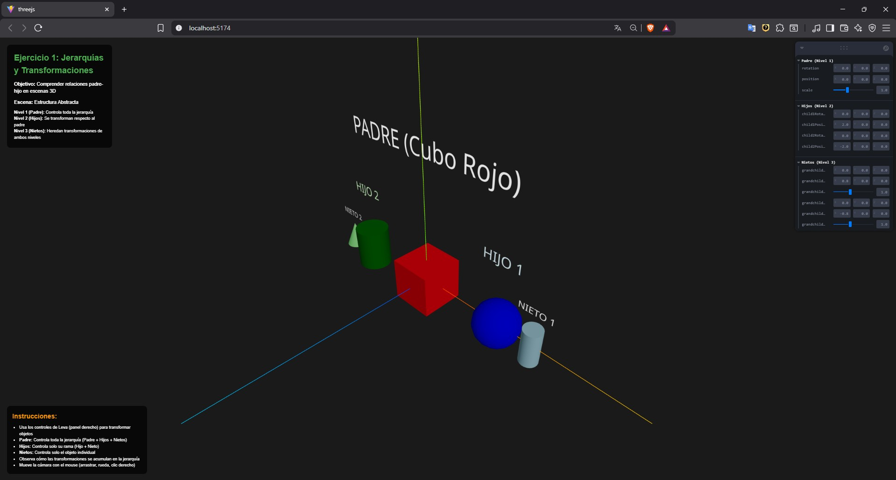
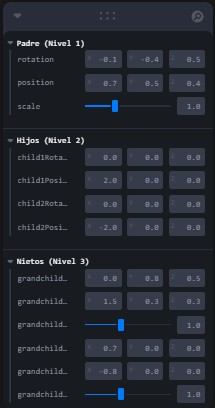
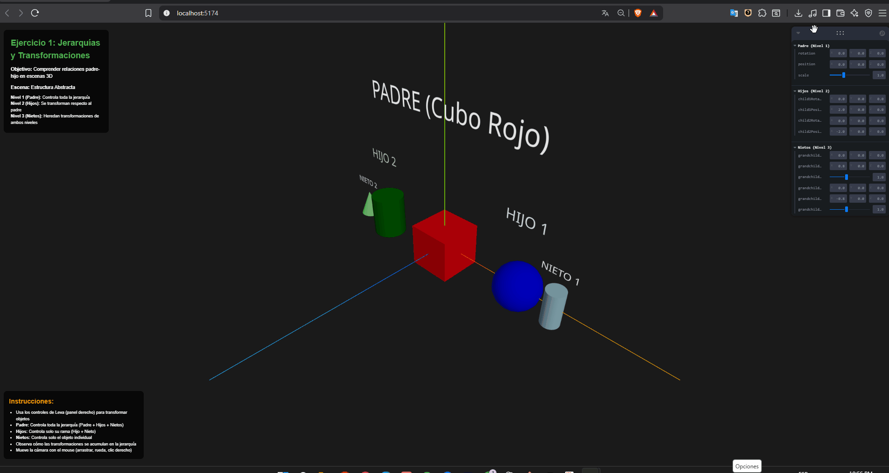
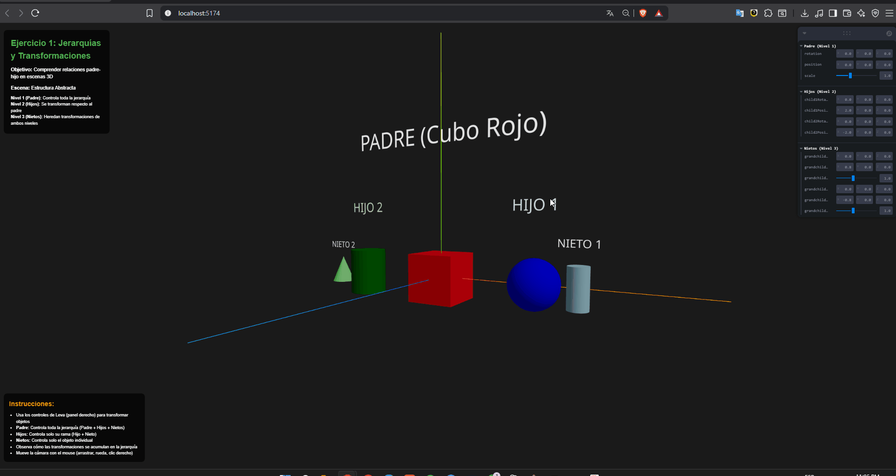
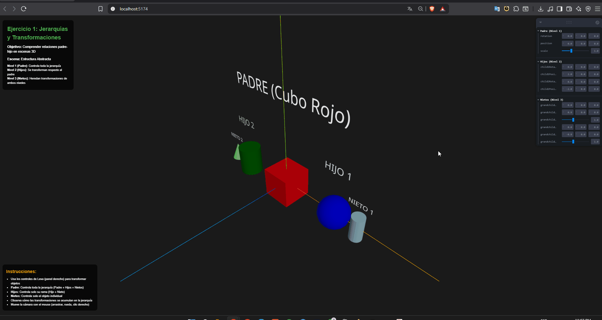

# Ejercicio 1: Árbol del Movimiento (Jerarquías y Transformaciones)

## Objetivo
Comprender relaciones padre-hijo en escenas 3D y efectos de transformaciones acumuladas.

## Implementación
Este ejercicio implementa una escena que demuestra jerarquías 3D:

### Estructura Abstracta
- **Padre (Nivel 1):** Cubo rojo que controla toda la jerarquía
- **Hijos (Nivel 2):** Esfera azul y cilindro verde con transformaciones independientes
- **Nietos (Nivel 3):** Cilindro y cono que heredan transformaciones de sus padres

## Características Técnicas

### Tecnologías Utilizadas
- **Three.js:** Motor de gráficos 3D
- **React Three Fiber:** Integración de Three.js con React
- **Leva:** Sistema de controles GUI moderno
- **@react-three/drei:** Utilidades adicionales para R3F

### Jerarquía de Transformaciones
1. **Transformaciones del Padre:** Afectan a toda la jerarquía
2. **Transformaciones de los Hijos:** Se aplican después de las del padre
3. **Transformaciones de los Nietos:** Heredan todas las transformaciones anteriores

### Controles Interactivos
- **Rotación:** En los tres ejes (X, Y, Z)
- **Posición:** Traslación en el espacio 3D
- **Escala:** Redimensionamiento uniforme
- **Selector de Escena:** Alternar entre estructura abstracta y árbol literal

## Cómo Ejecutar

### Prerrequisitos
- Node.js (versión 16 o superior)
- npm o yarn

### Instalación
```bash
cd threejs
npm install
```

### Ejecución
```bash
npm run dev
```


## Estructura del Código

```
src/
├── App.jsx          # Componente principal con ambas escenas
├── App.css          # Estilos para la interfaz
└── main.jsx         # Punto de entrada de la aplicación
```

### Componentes Principales

##programa general:

**Panel que muestra posición/rotación/escala actuales:**



#### `AbstractHierarchy`
- Implementa la escena con geometrías abstractas
- Demuestra claramente las transformaciones jerárquicas
- Ideal para entender conceptos matemáticos
- Cubo rojo (padre), esfera azul y cilindro verde (hijos), cilindro y cono (nietos)

## Conceptos Demostrados

### 1. Matrices de Transformación
- Cada objeto tiene su matriz de transformación local
- Las matrices se combinan en cascada (padre → hijo → nieto)
- El resultado final es la composición de todas las transformaciones

### 2. Sistemas de Coordenadas
- **Coordenadas Locales:** Relativas al objeto padre
- **Coordenadas Mundiales:** Posición final en la escena
- **Herencia de Transformaciones:** Los hijos se mueven con el padre

### 3. Jerarquías en Gráficos 3D
- **Ventajas:** Organización, reutilización, animaciones complejas
- **Aplicaciones:** Personajes articulados, vehículos, edificios

## Evidencia Visual

### GIFs Generados
- **Padre:** al mover o rotar el padre, se mueven todos (padre, hijo y nieto) porque los demás están dentro de su sistema de coordenadas, heredan su transformación.
  

- **Hijo:** al mover o rotar el hijo, solo se mueven el hijo y el nieto, porque el nieto depende del hijo, pero el padre no hereda nada de ellos.
  
  
- **Nieto:** al mover o rotar el nieto, solo se mueve él, ya que no tiene descendientes y sus transformaciones no afectan hacia arriba.
  

### Controles de Leva
Los controles permiten:
- Modificar transformaciones en tiempo real
- Ver efectos inmediatos en la jerarquía
- Experimentar con diferentes valores
- Entender la herencia de transformaciones

## Aprendizajes Obtenidos

1. **Comprensión de Jerarquías:** Cómo los objetos se relacionan en 3D
2. **Transformaciones Acumuladas:** Efecto de transformaciones en cascada
3. **Sistemas de Coordenadas:** Diferencias entre coordenadas locales y mundiales
4. **Controles GUI:** Implementación de interfaces para manipular escenas 3D
5. **React Three Fiber:** Integración moderna de Three.js con React


## Referencias

- [Three.js Documentation](https://threejs.org/docs/)
- [React Three Fiber](https://docs.pmnd.rs/react-three-fiber)
- [Leva Controls](https://github.com/pmndrs/leva)
- [@react-three/drei](https://github.com/pmndrs/drei)
