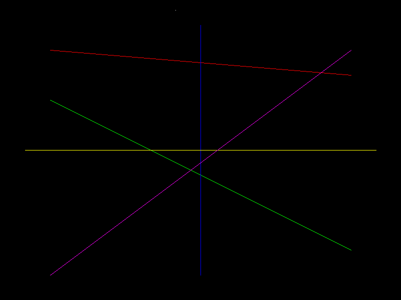
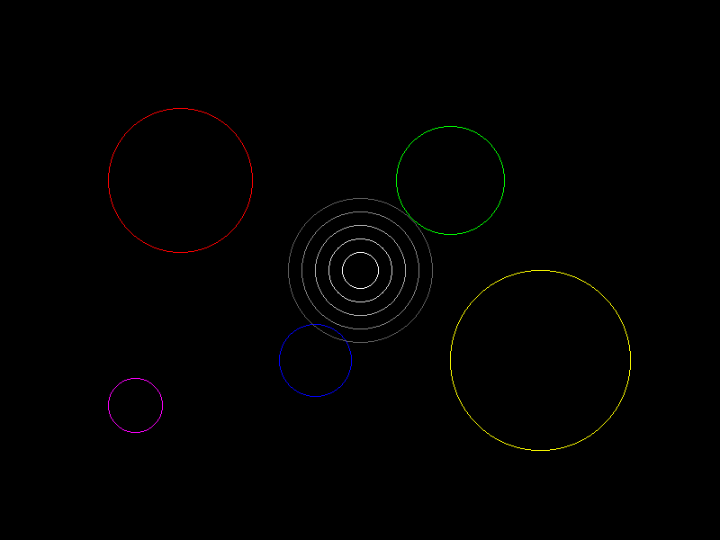
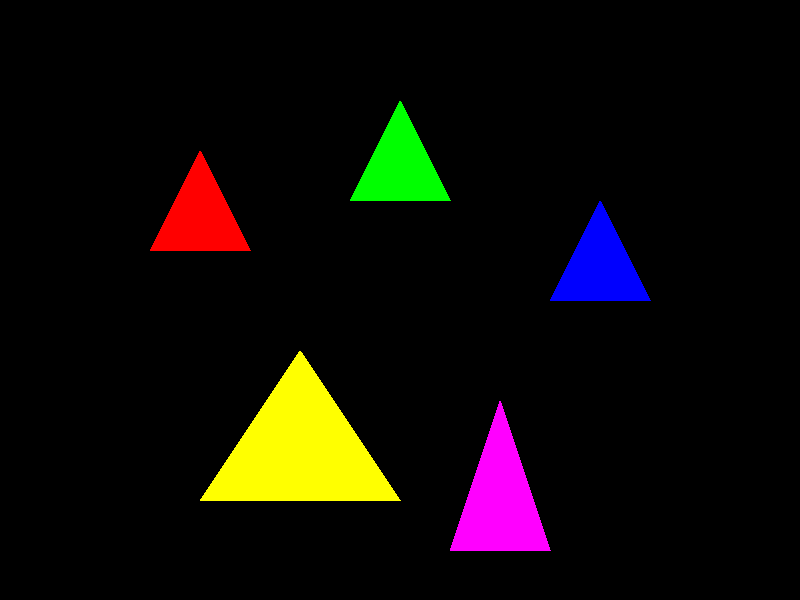
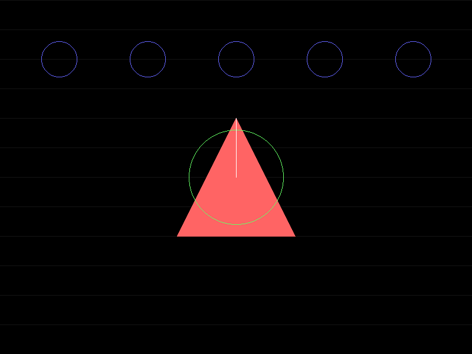

# Ejercicio 5: Rasterización desde Cero

## Objetivo
Implementar algoritmos clásicos de rasterización sin usar librerías de alto nivel.

## Algoritmos Implementados

### 1. Algoritmo de Bresenham (Líneas)

- **Propósito:** Dibujar líneas rectas eficientemente
- **Características:** 
  - Usa solo operaciones enteras
  - Algoritmo incremental
  - Precisión matemática
- **Complejidad:** O(n) donde n = max(|x1-x0|, |y1-y0|)

### 2. Algoritmo del Punto Medio (Círculos)

- **Propósito:** Dibujar círculos perfectos
- **Características:**
  - Simetría de 8 puntos
  - Decisión basada en punto medio
  - Solo operaciones aritméticas básicas
- **Complejidad:** O(π×r) donde r es el radio

### 3. Algoritmo Scanline (Triángulos)

- **Propósito:** Rellenar triángulos con color
- **Características:**
  - Relleno línea por línea
  - Maneja formas complejas
  - Eficiente para polígonos
- **Complejidad:** O(n×m) donde n es altura, m es ancho promedio

## Estructura del Código

```
05_rasterizacion_clasica/
├── rasterizacion_clasica.py    # Implementación principal
├── run.py                      # Script de ejecución
├── requirements.txt            # Dependencias
├── README.md                   # Este archivo
└── resultados/                 # Imágenes generadas
    ├── 01_lineas_bresenham.png
    ├── 02_circulos_punto_medio.png
    ├── 03_triangulos_scanline.png
    └── 04_composicion_final.png
```

## Cómo Ejecutar

### Opción 1: Script Automático
```bash
cd 05_rasterizacion_clasica
python run.py
```

### Opción 2: Manual
```bash
cd 05_rasterizacion_clasica
pip install -r requirements.txt
python rasterizacion_clasica.py
```

## Salidas Generadas

### 1. Líneas con Bresenham
- Líneas de diferentes ángulos y colores
- Demostración de precisión del algoritmo
- Comparación visual de diferentes pendientes

### 2. Círculos con Punto Medio
- Círculos de diferentes tamaños
- Patrones concéntricos
- Simetría perfecta

### 3. Triángulos con Scanline
- Triángulos de diferentes formas
- Relleno sólido sin gaps
- Manejo de vértices ordenados

### 4. Composición Final

- Combinación de todos los algoritmos
- Patrón decorativo complejo
- Demostración de integración

## Análisis Técnico

### Ventajas de los Algoritmos Clásicos
1. **Eficiencia:** Operaciones optimizadas para hardware básico
2. **Precisión:** Resultados matemáticamente exactos
3. **Simplicidad:** Fáciles de implementar y entender
4. **Historia:** Base de la computación gráfica moderna

### Limitaciones
1. **Formas Limitadas:** Solo líneas, círculos y triángulos básicos
2. **Sin Antialiasing:** Bordes pixelados
3. **Sin Texturas:** Solo colores sólidos
4. **Rendimiento:** No optimizado para GPU moderna

### Comparación con Métodos Modernos
- **GPUs Modernas:** Usan rasterización paralela masiva
- **Shaders:** Programación de píxeles y vértices
- **Antialiasing:** Suavizado de bordes automático
- **Texturas:** Mapeo complejo de imágenes


## Aplicaciones Prácticas

### En Computación Gráfica
- **Motores de Juegos:** Rasterización básica de primitivas
- **CAD:** Dibujo técnico preciso
- **Simulación:** Visualización de datos científicos

### En Educación
- **Comprensión:** Entender cómo funcionan las GPUs
- **Historia:** Evolución de la computación gráfica
- **Fundamentos:** Base para algoritmos más complejos


## Referencias Técnicas

- **Bresenham, J.E.** (1965). "Algorithm for computer control of a digital plotter"
- **Midpoint Circle Algorithm:** Variante del algoritmo de Bresenham
- **Scanline Algorithm:** Técnica de relleno de polígonos
- **Computer Graphics Principles and Practice** - Foley, van Dam, Feiner, Hughes

## Reflexión Final

Estos algoritmos, aunque simples, representan la base de toda la computación gráfica moderna. Comprender su funcionamiento interno nos permite:

1. **Apreciar la evolución** de la tecnología gráfica
2. **Entender limitaciones** de hardware básico
3. **Optimizar código** en situaciones específicas
4. **Desarrollar algoritmos nuevos** basados en estos fundamentos

La rasterización clásica sigue siendo relevante en sistemas embebidos, dispositivos de baja potencia y aplicaciones educativas donde la simplicidad y la eficiencia son prioritarias.
