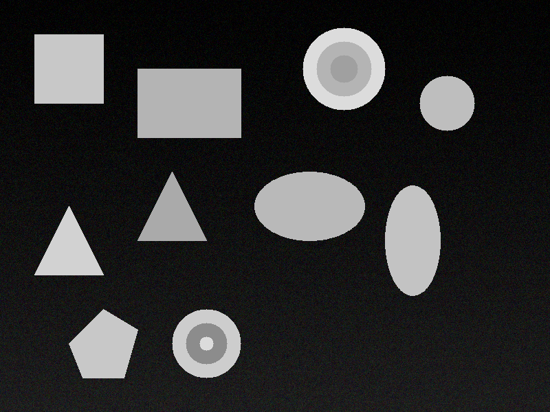
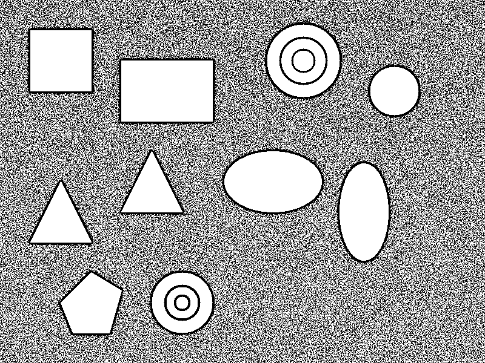
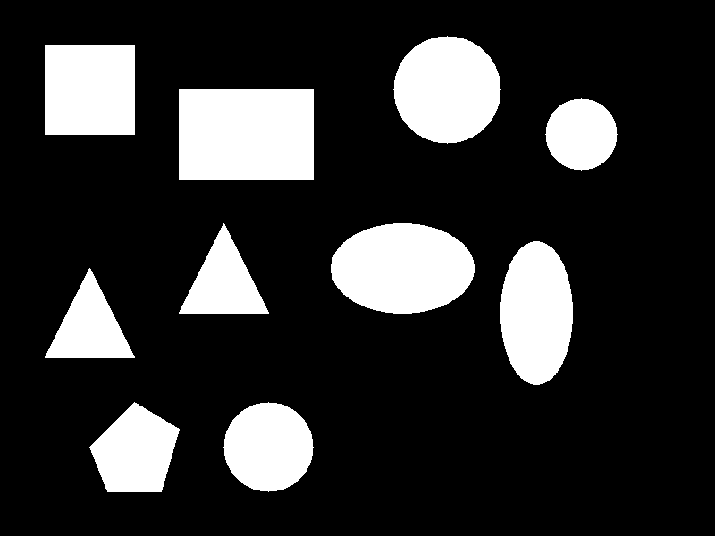
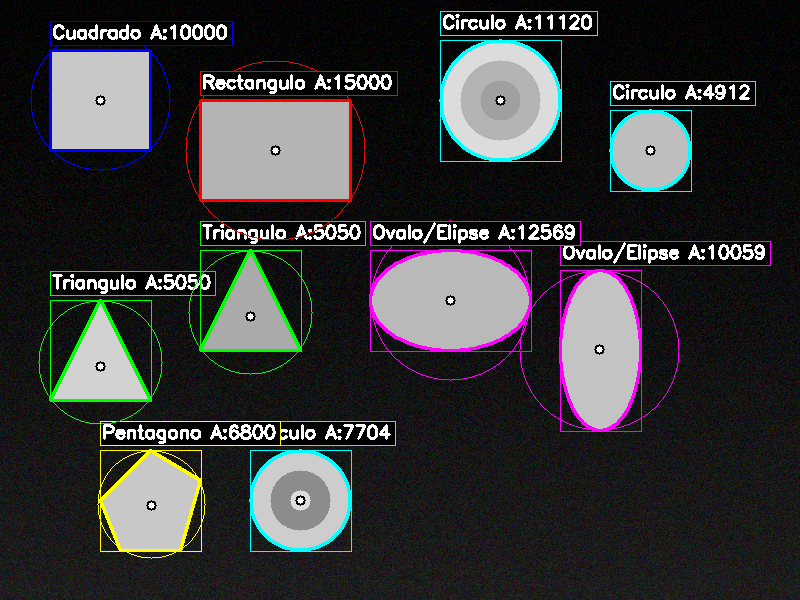
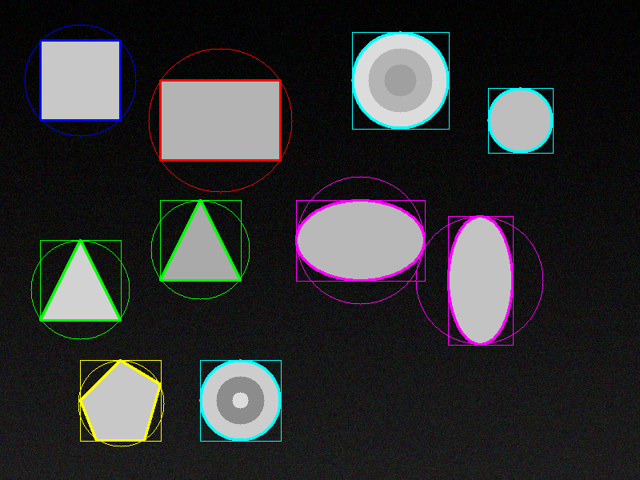
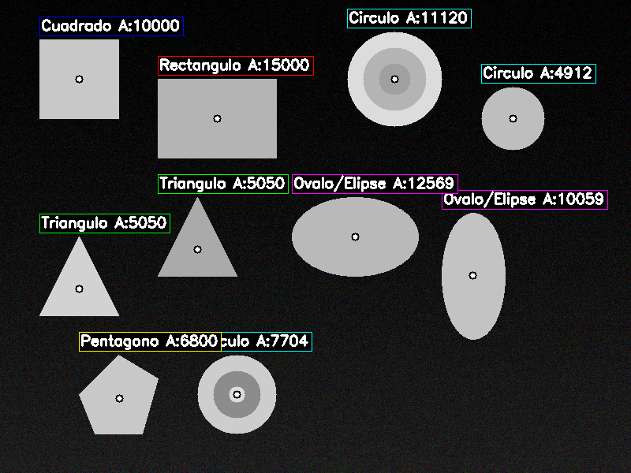
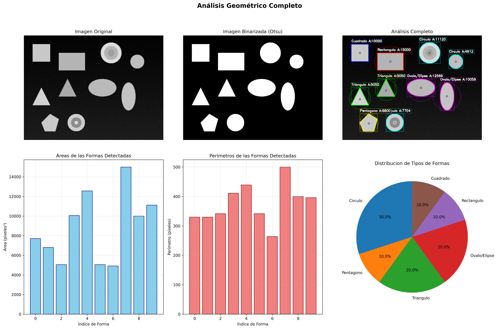

# Ejercicio 6: Análisis Geométrico (Centroide, Área, Perímetro)

## Objetivo
Extraer métricas de contornos en imágenes binarizadas y clasificar automáticamente formas geométricas.

## Características Implementadas

### 1. Binarización de Imágenes
- **Método Otsu:** Umbralización automática óptima
- **Método Adaptativo:** Adaptación local a variaciones de iluminación
- **Método Fijo:** Umbralización con valor manual

### 2. Detección de Contornos
- Algoritmo de Suzuki-Abe para encontrar contornos
- Filtrado de contornos pequeños
- Aproximación poligonal para simplificación

### 3. Métricas Geométricas Calculadas
- **Área:** Píxeles dentro del contorno
- **Perímetro:** Longitud del borde del contorno
- **Centroide:** Centro de masa usando momentos
- **Bounding Box:** Rectángulo delimitador mínimo
- **Círculo Mínimo:** Círculo envolvente mínimo
- **Relación de Aspecto:** Proporción ancho/alto
- **Extensión:** Área del contorno / área del bounding box
- **Solidez:** Área del contorno / área del convex hull

### 4. Clasificación Automática de Formas
- **Triángulos:** 3 vértices
- **Cuadrados:** 4 vértices con relación de aspecto ~1
- **Rectángulos:** 4 vértices con relación de aspecto ≠ 1
- **Círculos:** >8 vértices con alta solidez
- **Óvalos/Elipses:** >8 vértices con solidez media
- **Pentágonos:** 5 vértices
- **Hexágonos:** 6 vértices
- **Polígonos Regulares:** Múltiples vértices con alta solidez
- **Formas Irregulares:** Baja solidez o patrón no reconocible

## Estructura del Código

```
06_analisis_figuras_geometricas/
├── analisis_geometrico.py     # Implementación principal
├── run.py                     # Script de ejecución
├── requirements.txt           # Dependencias
├── package.json              # Configuración npm
├── README.md                 # Este archivo
└── resultados/               # Imágenes generadas
    ├── 00_imagen_original.png
    ├── 01_binarizacion_otsu.png
    ├── 02_binarizacion_adaptativa.png
    ├── 03_binarizacion_fija.png
    ├── 04_analisis_completo.png
    ├── 05_solo_contornos.png
    ├── 06_solo_metricas.png
    └── 07_analisis_estadistico.png
```

## Cómo Ejecutar

### Opción 1: Script Automático
```bash
cd 06_analisis_figuras_geometricas
npm run dev
```

### Opción 2: Python Directo
```bash
cd 06_analisis_figuras_geometricas
pip install -r requirements.txt
python run.py
```

## Salidas Generadas

### 1. Imagen Original

- Imagen sintética con formas geométricas variadas
- Incluye rectángulos, círculos, triángulos y formas irregulares


### 2. Binarización

- **Otsu:** Umbralización automática óptima


- **Adaptativa:** Adaptación local a variaciones


- **Fija:** Umbralización con valor manual (127)


### 3. Análisis Completo

- Contornos detectados con colores por tipo de forma
- Bounding boxes en color de forma
- Círculos mínimos envolventes
- Centroides marcados
- Etiquetas con área de cada forma

### 4. Visualizaciones Especializadas
- **Solo Contornos:** Enfoque en detección de bordes



- **Solo Métricas:** Enfoque en mediciones



- **Análisis Estadístico:** Gráficos de distribución



## Algoritmos Utilizados

### 1. Detección de Contornos (Suzuki-Abe)
```python
contours, _ = cv2.findContours(binary_image, cv2.RETR_EXTERNAL, cv2.CHAIN_APPROX_SIMPLE)
```

### 2. Cálculo de Momentos (Centroide)
```python
moments = cv2.moments(contour)
cx = int(moments['m10'] / moments['m00'])
cy = int(moments['m01'] / moments['m00'])
```

### 3. Aproximación Poligonal
```python
epsilon = 0.02 * cv2.arcLength(contour, True)
approx = cv2.approxPolyDP(contour, epsilon, True)
vertices = len(approx)
```

### 4. Convex Hull
```python
hull = cv2.convexHull(contour)
hull_area = cv2.contourArea(hull)
solidity = contour_area / hull_area
```

## Métricas Detalladas

### Área
- **Cálculo:** `cv2.contourArea(contour)`
- **Unidad:** Píxeles cuadrados
- **Uso:** Tamaño relativo de formas

### Perímetro
- **Cálculo:** `cv2.arcLength(contour, True)`
- **Unidad:** Píxeles
- **Uso:** Longitud del borde

### Centroide
- **Cálculo:** Momentos de primer orden
- **Fórmula:** `cx = M10/M00`, `cy = M01/M00`
- **Uso:** Centro de masa de la forma

### Relación de Aspecto
- **Cálculo:** `width / height` del bounding box
- **Rango:** 0 a ∞
- **Uso:** Distinguir cuadrados de rectángulos

### Extensión
- **Cálculo:** `area / (width × height)`
- **Rango:** 0 a 1
- **Uso:** Qué tan "lleno" está el bounding box

### Solidez
- **Cálculo:** `area / convex_hull_area`
- **Rango:** 0 a 1
- **Uso:** Qué tan "convexa" es la forma

## Clasificación de Formas

### Criterios de Clasificación
1. **Número de vértices** (aproximación poligonal)
2. **Relación de aspecto** (cuadrado vs rectángulo)
3. **Solidez** (convexo vs cóncavo)
4. **Extensión** (compacto vs disperso)

### Algoritmo de Clasificación
```python
if vertices == 3:
    return "Triángulo"
elif vertices == 4:
    if 0.9 <= aspect_ratio <= 1.1:
        return "Cuadrado"
    else:
        return "Rectángulo"
elif vertices > 8:
    if solidity > 0.9:
        return "Círculo"
    else:
        return "Óvalo/Elipse"
# ... más criterios
```

## Aplicaciones Prácticas

### En Visión por Computador
- **Detección de objetos:** Identificar formas en imágenes
- **Control de calidad:** Verificar formas de productos
- **Robótica:** Navegación basada en formas
- **Medicina:** Análisis de células o tejidos

### En Automatización Industrial
- **Inspección visual:** Detectar defectos en productos
- **Clasificación:** Separar objetos por forma
- **Medición:** Dimensiones automáticas
- **Tracking:** Seguimiento de objetos en movimiento

### Limitaciones Actuales
1. **Formas simples:** Solo polígonos básicos
2. **Ruido:** Sensible a ruido en imágenes
3. **Oclusión:** No maneja objetos parcialmente ocultos
4. **Escala:** Sensible a cambios de tamaño

### Mejoras Futuras
1. **Machine Learning:** Clasificación con CNN
2. **Robustez:** Filtros de ruido avanzados
3. **3D:** Análisis de formas tridimensionales
4. **Tiempo real:** Optimización para video

## Conceptos Aprendidos
1. **Procesamiento de imágenes:** Pipeline completo de CV
2. **Matemática computacional:** Momentos, geometría
3. **Algoritmos de clasificación:** Reglas de decisión
4. **Visualización:** Representación de datos complejos
5. **Análisis estadístico:** Distribuciones y métricas

## Reflexión Técnica

Este ejercicio demuestra la complejidad y potencia del análisis geométrico en visión por computador. Los algoritmos implementados forman la base de sistemas más avanzados:

- **Robustez:** Manejo de variaciones en iluminación y ruido
- **Precisión:** Cálculos matemáticamente exactos
- **Eficiencia:** Algoritmos optimizados para tiempo real
- **Escalabilidad:** Fácil extensión a nuevas formas

La combinación de técnicas clásicas (momentos, convex hull) con métodos modernos (aproximación poligonal, clasificación automática) muestra la evolución continua del campo de la visión por computador.

## Referencias

- **OpenCV Documentation:** [Contours](https://docs.opencv.org/master/d4/d73/tutorial_py_contours_begin.html)
- **Moments:** [Image Moments](https://docs.opencv.org/master/dd/d49/tutorial_py_contour_features.html)

