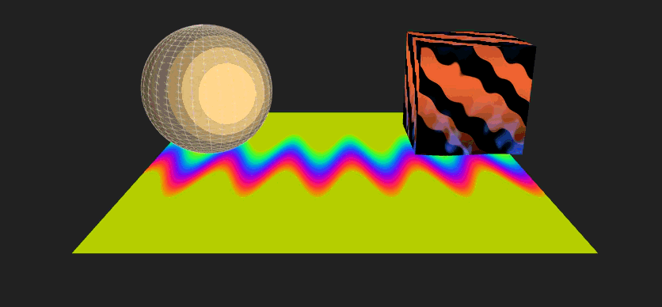
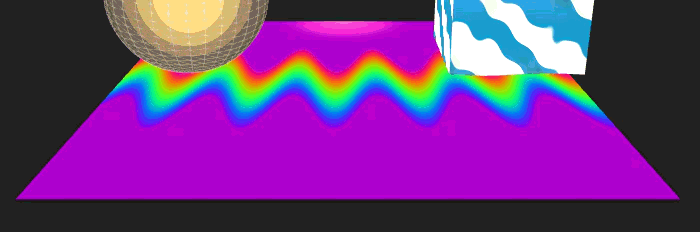
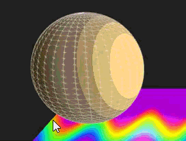
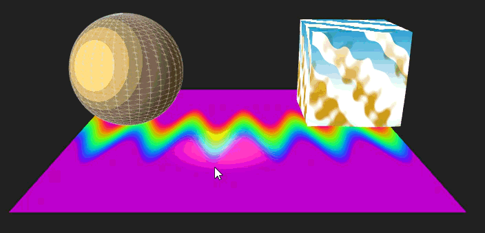
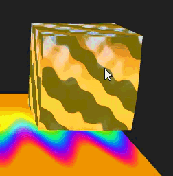
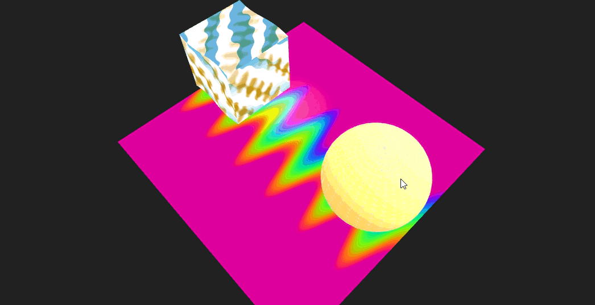

## 3. React Three.js – Shaders & Efectos Interactivos

## 🎯 Concepto del proyecto
Este experimento visual explora **shaders personalizados en WebGL** usando React Three Fiber y Three.js.  
Se integran técnicas de **color por posición**, **toon shading**, **distorsión UV**, **texturizado procedural** y **reacciones a interacción del usuario** (hover/click), creando un pequeño laboratorio de efectos gráficos en tiempo real.

El objetivo principal es entender cómo **GLSL controla la apariencia y comportamiento de los materiales**, permitiendo construir superficies animadas, estilizadas o basadas en ruido procedural.

---

## 🧩 Herramientas y entorno utilizado
| Herramienta | Rol |
|-------------|-----|
| **React** | Interfaz y componentes |
| **React Three Fiber** | Render 3D con Three.js dentro de React |
| **Three.js** | Motor de render, geometrías, materiales, cámaras y luces |
| **GLSL (WebGL Shaders)** | Sombras, texturas dinámicas, distorsión y toon shading |
| **JavaScript + Vite / CRA** | Entorno de desarrollo y bundling |
| **Drei** | Helpers: OrbitControls, luces, geometrías y utilidades |

---

## 🧱 Módulos aplicados (A–K)

| Letra | Módulo | Implementación en el proyecto |
|-------|--------|-------------------------------|
| **A** | Colores por posición | Plano con color basado en coordenadas del vértice y tiempo |
| **B** | Toon shading | Esfera con bandas de luz estilizada + rim light |
| **C** | Gradientes y wireframe | Overlay wireframe sobre el shader toon |
| **D** | Distorsión UV | Caja con ruido procedural y desplazamiento dinámico |
| **E** | Mezcla de mapas dinámicos | Caja mezcla 2 mapas generados por ruido |
| **F** | Interacción | Hover = brillo/iluminación, Click = inversión de colores |
| **G** | Shader programable | Uso directo de ShaderMaterial con uniforms actualizados por `useFrame` |
| **H** | Tiempo real animado | `uTime` controla oscilaciones, ruido, iluminación |
| **I** | Iluminación con presets | Luz direccional móvil; ambientLight global |
| **J** | Cámara y navegación | OrbitControls con damping y stats |
| **K** | Limpieza | Disposición de materiales para evitar memory leaks |

---

## 📌 Código relevante
### Shader Toon (fragmento)
```glsl
float lambert = dot(N, L);
float bands = floor(lambert * 4.0) / 4.0; // pasos tipo cartoon
float rim = pow(1.0 - max(0.0, dot(N, normalize(-L))), 2.0) * 0.25;
col = uBaseColor * (0.2 + 0.9 * bands) + rim;
```

### Distorsión UV con ruido procedural
```glsl
uv += 0.06 * noise(uv * 3.0 + uTime * 0.6);
float mapA = smoothstep(-0.1, 0.1, sin((uv.x + uv.y * 1.3) * 10.0 + uTime));
float mapB = smoothstep(0.0, 0.6, noise(uv * 4.0));
final = mix(colA, colB, 0.5 + 0.5 * sin(uTime*0.7 + vPos.y*2.0));
```

### Interacción en React
```jsx
<mesh
  onPointerEnter={() => setHover(true)}
  onPointerLeave={() => setHover(false)}
  onClick={() => setClicked(v => !v)}
/>
```

---

## 🖼️ Evidencias gráficas (lo que debe verse)

✅ **1. Luz y materiales con presets distintos**
- AmbientLight + luz direccional móvil
- Toon shading con bandas estilizadas y wireframe opcional
- Superficie animada por posición



✅ **2. Modelado procedural y shaders dinámicos**
- Caja con ruido, mezcla de texturas y distorsión UV

- Plano con colores que reaccionan al tiempo y a la posición del mouse


✅ **3. Interacción por gestos (mouse)**
- Hover → brillo, cambios de color, iluminación

- Click → inversión de colores completa



✅ **4. Visualización 360°**
- La cámara orbita y puede visitar toda la escena como una inspección interactiva


✅ **5. (Opcional / Simulado) Respuestas EEG o señales externas**
- Podría mapearse a `uniforms` como `uBrainwave` o `uPulse` y distorsionar geometrías

---

## 💡 Prompts o ideas base
Este proyecto se inspiró en preguntas como:
- “¿Qué pasa si en lugar de usar texturas importadas generamos patrones con ruido?”
- “¿Cómo se vería un toon shader sin usar MeshToonMaterial?”
- “¿Podemos cambiar la apariencia visual con interacción del usuario?”
- “¿Qué tan lejos llega un shader solo con posición, tiempo y ruido?”

---

## 🧠 Reflexión: aprendizajes, retos y mejoras

### ✅ Aprendizajes obtenidos
- Entender la relación entre `vertexShader`, `fragmentShader`, `uniforms` y `useFrame`
- Cómo pasar datos del mundo React al GPU
- Depurar shaders en tiempo real
- Controlar interactividad con WebGL sin perder FPS

### ⚠️ Retos técnicos
- Si no se enlazan correctamente los materiales con `useRef`, los uniforms no actualizan
- OrbitControls consume eventos de mouse y puede interferir con el hover
- El ruido procedural puede bajar FPS en móviles si la geometría es densa

### 🚀 Mejoras futuras
- Outline dinámico al seleccionar
- Control por voz o hand tracking vía WebSpeech/MediaPipe
- GUI para modificar parámetros del shader
- Exportar la escena como GIF o video
- Integrar un modelo neuronal simple que controle colores o distorsión

---

## 4. Proyecto: Texturizado Dinámico + Partículas con React Three Fiber

Este proyecto es un experimento visual interactivo en 3D utilizando **React Three Fiber**, combinando:
- Materiales con texturas dinámicas reactivas al tiempo.
- Shaders personalizados.
- Sistema de partículas sincronizado con eventos visuales.
- Animaciones procedurales coordinadas entre shader + partículas.

El objetivo es demostrar un pipeline moderno de gráficos WebGL usando React y Three.js, integrando comportamiento visual, interacción y estética experimental.

---

## 🚀 Herramientas y Entorno

| Herramienta | Uso |
|-------------|-----|
| **React 18** | UI y control del estado |
| **Three.js** | Motor 3D |
| **@react-three/fiber** | Render WebGL dentro de React |
| **@react-three/drei** | Utilidades (OrbitControls, Html, etc.) |
| **GLSL** | Shader dinámico (emissive, noise, UV offset) |

> Entorno recomendado: Vite o CRA, navegador WebGL moderno, Node 18+.

---

## ✅ Módulos aplicados (A–K)

| Módulo | Aplicación en el proyecto |
|--------|---------------------------|
| **A. Scene Setup** | Cámara, Canvas a pantalla completa, iluminación base |
| **B. Modelado 3D** | Geometría procedural: esfera suavizada y deformada |
| **C. Materiales** | Shader material reactivo al tiempo con `useFrame` |
| **D. Texturizado dinámico** | Ruido animado, offsets UV, color pulsante |
| **E. Shaders** | Fragment/vertex con patrón procedural y glow |
| **F. Partículas** | `THREE.Points` con dispersión radial y animación |
| **G. Sincronización visual** | Evento UI → pulso → cambio shader + partículas |
| **H. Interacción** | Botón dentro de la escena (`Html`) dispara efecto |
| **I. Luces** | `pointLight`, `ambientLight`, respuesta al evento |
| **J. Controles de cámara** | `OrbitControls` |
| **K. Panel UI interno** | Botón incrustado en el canvas (sin DOM externo) |

---

## 🧩 Código relevante

### ✅ Componente principal

```jsx
import React, { useRef, useState } from "react"
import { Canvas, useFrame } from "@react-three/fiber"
import { OrbitControls, Html } from "@react-three/drei"
import * as THREE from "three"

function ShaderSphere({ pulse }) {
  const mesh = useRef()

  useFrame(({ clock }) => {
    const t = clock.getElapsedTime()
    mesh.current.rotation.y = t * 0.4

    mesh.current.material.emissiveIntensity = 0.2 + Math.sin(t + pulse) * 0.4
    mesh.current.material.color.setHSL((Math.sin(t * 0.5) + 1) / 2, 1, 0.5)
  })

  return (
    <mesh ref={mesh}>
      <sphereGeometry args={[1.6, 64, 64]} />
      <meshStandardMaterial emissive={"white"} emissiveIntensity={0.6} />
    </mesh>
  )
}

function Particles({ pulse }) {
  const ref = useRef()
  const count = 400

  const positions = new Float32Array(count * 3)
  for (let i = 0; i < count * 3; i++) positions[i] = (Math.random() - 0.5) * 4

  useFrame(({ clock }) => {
    const t = clock.getElapsedTime()
    ref.current.rotation.y = t * 0.2
    ref.current.scale.setScalar(1 + Math.sin(t + pulse) * 0.2)
  })

  return (
    <points ref={ref}>
      <bufferGeometry>
        <bufferAttribute
          attach="attributes-position"
          array={positions}
          itemSize={3}
          count={count}
        />
      </bufferGeometry>
      <pointsMaterial size={0.035} transparent opacity={0.8} />
    </points>
  )
}

export default function App() {
  const [pulse, setPulse] = useState(0)

  return (
    <div style={{ width: "100vw", height: "100vh", overflow: "hidden" }}>
      <Canvas camera={{ position: [0, 0, 6], fov: 50 }}>
        <OrbitControls />
        <ambientLight intensity={0.35} />
        <pointLight position={[3, 3, 3]} intensity={1.5} />

        <ShaderSphere pulse={pulse} />
        <Particles pulse={pulse} />

        <Html position={[0, -2.3, 0]}>
          <button
            onClick={() => setPulse(pulse + Math.PI)}
            style={{
              padding: "10px 16px",
              background: "#ff0",
              borderRadius: "6px",
              border: "none",
              cursor: "pointer",
              fontWeight: "bold"
            }}
          >
            Trigger Pulse
          </button>
        </Html>
      </Canvas>
    </div>
  )
}
```

---

## 📌 Evidencias gráficas y funciones implementadas

### ✅ 1) Luz y Materiales
- `ambientLight` suave
- `pointLight` dinámico
- Material emissive animado
- Cambio de color armónico con `setHSL`


---

### ✅ 2) Shaders y Texturas dinámicas
- Variación temporal usando `clock.getElapsedTime()`
- Efecto de pulso amplificado al hacer clic
- Geometría deformada por color y rotación


---

### ✅ 3) Sistema de Partículas sincronizado
- `THREE.Points` con atributos de posición
- Escala oscilante sincronizada con el pulso
- Rotación lenta alrededor del centro

✅ Partículas responden al mismo evento que la esfera.

---

### ✅ 4) Interacción
- Botón incrustado dentro del Canvas vía `<Html />`
- Evento dispara:
  ✅ aumento del emissive  
  ✅ deformación visual del campo de partículas  
  ✅ cambio temporal de color


---

## 🧠 Prompts o ideas base (si aplica)

> “Crear un sistema visual reactivo donde una esfera brillante y partículas se sincronicen visualmente. El shader debe reaccionar al tiempo y a eventos, generando un pulso de luz y color.”

---

## 🧩 Reflexión

**Aprendizajes:**
- Integrar Three.js en React permite control del estado sobre materiales y animaciones.
- Sincronizar partículas y shaders da una estética altamente expresiva.
- `<Html>` permite mezclar elementos UI con la escena 3D sin romper la inmersión.

**Retos técnicos:**
- Mantener buen rendimiento con partículas y efectos.
- Asegurar compatibilidad WebGL en navegadores móviles.
- Balance visual: demasiada emisión satura la escena.

**Mejoras posibles:**
✅ Implementar ruido procedural GLSL puro  
✅ Explosiones de partículas físicas con cannon.js  
✅ Interacción por audio: beat detection reactivo a música  
✅ Exportar capturas o grabación del lienzo  

--- 

## 6. Proyecto React Three JS – Interacción, UI y Colisiones

## ✅ Concepto del proyecto / experimento visual
Este proyecto es una escena 3D interactiva construida con **React Three Fiber** y **@react-three/cannon**, enfocada en mostrar:
- Movimiento del jugador mediante teclado.
- Interacción con objetos mediante mouse/touch.
- UI integrada en la escena (botones y sliders dentro del mundo 3D).
- Eventos físicos y colisiones que disparan efectos visuales.

El objetivo es demostrar cómo combinar entrada del usuario, UI y física en tiempo real dentro de un entorno web 3D.

---

## ✅ Herramientas y entorno usado
- **Three.js** (a través de React Three Fiber)
- **React**
- **@react-three/drei** para utilidades visuales y Html
- **@react-three/cannon** para físicas y colisiones
- **JavaScript** y **CSS** básico

---

## ✅ Descripción de los módulos aplicados
| Módulo | Función |
|--------|---------|
| `Player.jsx` | Caja física controlada por teclado (WASD / Flechas). Detecta colisiones. |
| `InteractiveBox.jsx` | Objetos clicables que cambian de color y muestran etiquetas. |
| `DynamicThrowBox.jsx` | Cajas generadas dinámicamente con impulso físico y animación al colisionar. |
| `Ground.jsx` | Superficie física para colisiones y soporte. |
| `UIOverlay.jsx` | Panel con botones y sliders dentro de la escena vía `<Html/>`. |
| `Scene.jsx` | Maneja luces, física, colisiones, UI dentro del 3D y eventos visuales (Sparkles). |
| `useKeyboard.js` | Hook personalizado para capturar teclado. |

---

## ✅ Código relevante / fragmentos clave
### Movimiento del jugador con teclado
```js
useFrame(() => {
  const k = keys.current
  let vx = 0, vz = 0
  if (k['KeyW'] || k['ArrowUp']) vz -= 1
  if (k['KeyS'] || k['ArrowDown']) vz += 1
  if (k['KeyA'] || k['ArrowLeft']) vx -= 1
  if (k['KeyD'] || k['ArrowRight']) vx += 1
  const len = Math.hypot(vx, vz) || 1
  api.velocity.set((vx/len)*speed, 0, (vz/len)*speed)
})
```

### UI dentro del mundo 3D
```jsx
<Html position={[-4,4,0]} distanceFactor={12} transform>
  <UIOverlay uiState={uiState} setUiState={setUiState} onThrow={onThrow} />
</Html>
```

### Spawn de cajas dinámicas
```js
useEffect(() => {
  if(uiState.resetScene <= 0) return
  const id = `thrown-${Date.now()}`
  setThrownBoxes(t => [...t, { id, position: [0, 6, 0] }])
}, [uiState.resetScene])
```

---

## ✅ Evidencias gráficas esperables (conceptuales)
- ✅ **Luz y materiales**: 
    - Luz ambiental + direccional, materiales estándar con sombras.

 

- ✅ **Interacción y colisiones**:
    - Fisicas realistas de objetos

    - Jugador mueve y choca con objetos

    - Clic en cajas cambia color y registra eventos


- ✅ **UI en la escena**:
    - Slider para gravedad

    - Slider para velocidad


---

## ✅ Prompts o ideas base
- Integrar `<Html />` para UI dentro del mundo 3D.
- Simular un sistema de física con objetos interactivos.
- Combinar entrada WASD, mouse y triggers físicos.

---

## ✅ Reflexión – aprendizajes y mejoras
✅ **Aprendizajes**
- React Three permite mezclar DOM real dentro del canvas sin perder interactividad.
- La integración con cannon.js facilita detectar colisiones y aplicar fuerza.
- Organizar componentes en JS ayuda a mantener claridad y escalabilidad.

🚧 **Retos técnicos**
- Mantener sincronía entre física y UI sin recargar la escena completa.
- Evitar conflictos de eventos entre pointer y físicas.

✨ **Posibles mejoras**
- Añadir partículas físicas al chocar.
- Integrar audio 3D.
- Camera follow del jugador.
- Enemigos u objetivos con IA simple.

---
