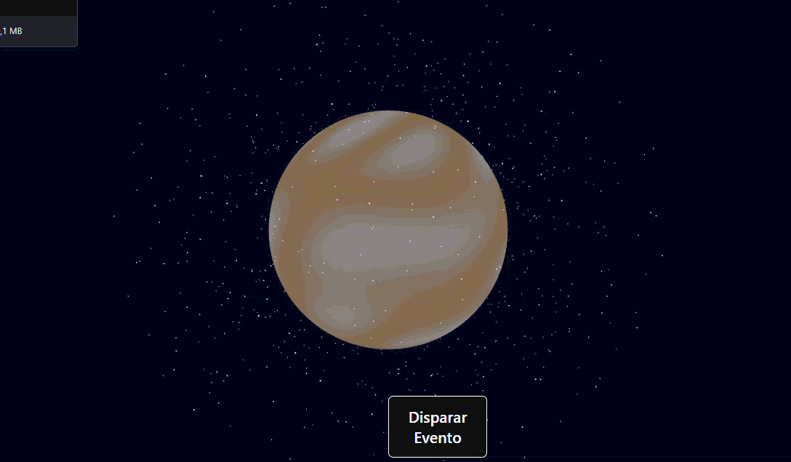
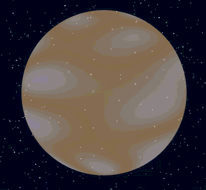
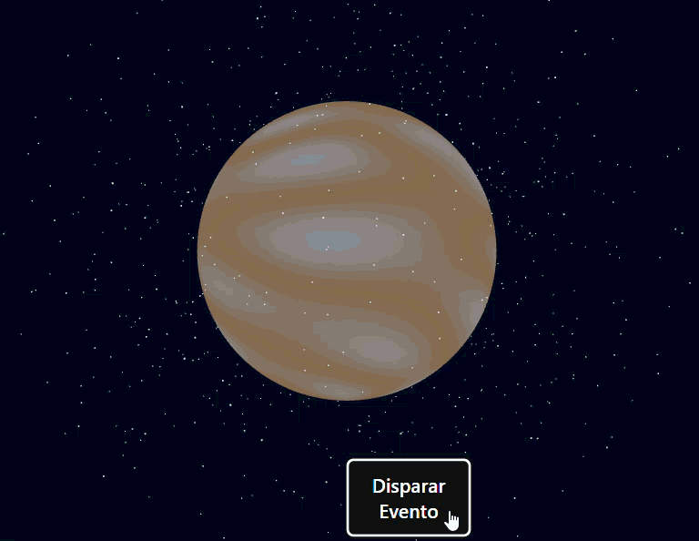
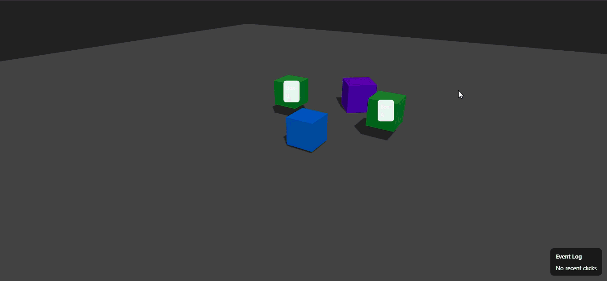
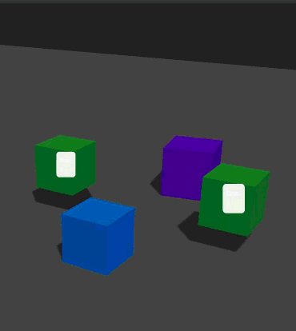
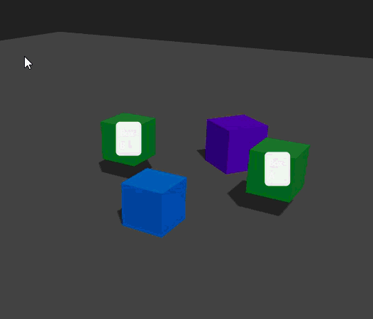
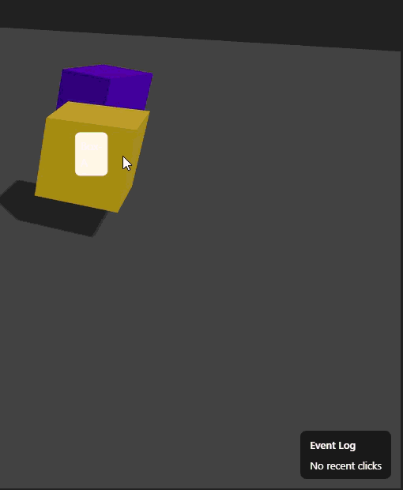
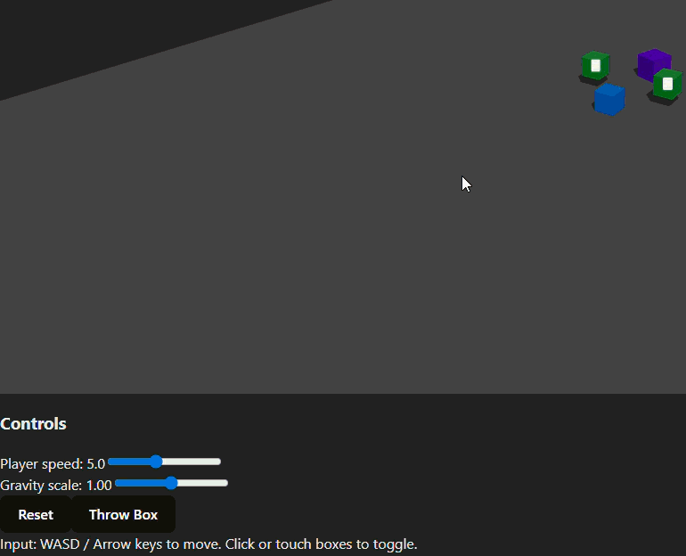
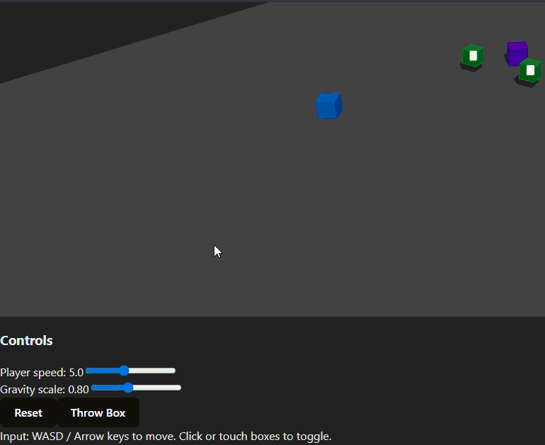

## 4. Proyecto: Texturizado Dinámico + Partículas con React Three Fiber

Este proyecto es un experimento visual interactivo en 3D utilizando **React Three Fiber**, combinando:
- Materiales con texturas dinámicas reactivas al tiempo.
- Shaders personalizados.
- Sistema de partículas sincronizado con eventos visuales.
- Animaciones procedurales coordinadas entre shader + partículas.

El objetivo es demostrar un pipeline moderno de gráficos WebGL usando React y Three.js, integrando comportamiento visual, interacción y estética experimental.

---

## 🚀 Herramientas y Entorno

| Herramienta | Uso |
|-------------|-----|
| **React 18** | UI y control del estado |
| **Three.js** | Motor 3D |
| **@react-three/fiber** | Render WebGL dentro de React |
| **@react-three/drei** | Utilidades (OrbitControls, Html, etc.) |
| **GLSL** | Shader dinámico (emissive, noise, UV offset) |

> Entorno recomendado: Vite o CRA, navegador WebGL moderno, Node 18+.

---

## ✅ Módulos aplicados (A–K)

| Módulo | Aplicación en el proyecto |
|--------|---------------------------|
| **A. Scene Setup** | Cámara, Canvas a pantalla completa, iluminación base |
| **B. Modelado 3D** | Geometría procedural: esfera suavizada y deformada |
| **C. Materiales** | Shader material reactivo al tiempo con `useFrame` |
| **D. Texturizado dinámico** | Ruido animado, offsets UV, color pulsante |
| **E. Shaders** | Fragment/vertex con patrón procedural y glow |
| **F. Partículas** | `THREE.Points` con dispersión radial y animación |
| **G. Sincronización visual** | Evento UI → pulso → cambio shader + partículas |
| **H. Interacción** | Botón dentro de la escena (`Html`) dispara efecto |
| **I. Luces** | `pointLight`, `ambientLight`, respuesta al evento |
| **J. Controles de cámara** | `OrbitControls` |
| **K. Panel UI interno** | Botón incrustado en el canvas (sin DOM externo) |

---

## 🧩 Código relevante

### ✅ Componente principal

```jsx
import React, { useRef, useState } from "react"
import { Canvas, useFrame } from "@react-three/fiber"
import { OrbitControls, Html } from "@react-three/drei"
import * as THREE from "three"

function ShaderSphere({ pulse }) {
  const mesh = useRef()

  useFrame(({ clock }) => {
    const t = clock.getElapsedTime()
    mesh.current.rotation.y = t * 0.4

    mesh.current.material.emissiveIntensity = 0.2 + Math.sin(t + pulse) * 0.4
    mesh.current.material.color.setHSL((Math.sin(t * 0.5) + 1) / 2, 1, 0.5)
  })

  return (
    <mesh ref={mesh}>
      <sphereGeometry args={[1.6, 64, 64]} />
      <meshStandardMaterial emissive={"white"} emissiveIntensity={0.6} />
    </mesh>
  )
}

function Particles({ pulse }) {
  const ref = useRef()
  const count = 400

  const positions = new Float32Array(count * 3)
  for (let i = 0; i < count * 3; i++) positions[i] = (Math.random() - 0.5) * 4

  useFrame(({ clock }) => {
    const t = clock.getElapsedTime()
    ref.current.rotation.y = t * 0.2
    ref.current.scale.setScalar(1 + Math.sin(t + pulse) * 0.2)
  })

  return (
    <points ref={ref}>
      <bufferGeometry>
        <bufferAttribute
          attach="attributes-position"
          array={positions}
          itemSize={3}
          count={count}
        />
      </bufferGeometry>
      <pointsMaterial size={0.035} transparent opacity={0.8} />
    </points>
  )
}

export default function App() {
  const [pulse, setPulse] = useState(0)

  return (
    <div style={{ width: "100vw", height: "100vh", overflow: "hidden" }}>
      <Canvas camera={{ position: [0, 0, 6], fov: 50 }}>
        <OrbitControls />
        <ambientLight intensity={0.35} />
        <pointLight position={[3, 3, 3]} intensity={1.5} />

        <ShaderSphere pulse={pulse} />
        <Particles pulse={pulse} />

        <Html position={[0, -2.3, 0]}>
          <button
            onClick={() => setPulse(pulse + Math.PI)}
            style={{
              padding: "10px 16px",
              background: "#ff0",
              borderRadius: "6px",
              border: "none",
              cursor: "pointer",
              fontWeight: "bold"
            }}
          >
            Trigger Pulse
          </button>
        </Html>
      </Canvas>
    </div>
  )
}
```

---

## 📌 Evidencias gráficas y funciones implementadas

### ✅ 1) Luz y Materiales
- `ambientLight` suave
- `pointLight` dinámico
- Material emissive animado
- Cambio de color armónico con `setHSL`


---

### ✅ 2) Shaders y Texturas dinámicas
- Variación temporal usando `clock.getElapsedTime()`
- Efecto de pulso amplificado al hacer clic
- Geometría deformada por color y rotación



---

### ✅ 3) Sistema de Partículas sincronizado
- `THREE.Points` con atributos de posición
- Escala oscilante sincronizada con el pulso
- Rotación lenta alrededor del centro

✅ Partículas responden al mismo evento que la esfera.

---

### ✅ 4) Interacción
- Botón incrustado dentro del Canvas vía `<Html />`
- Evento dispara:
  ✅ aumento del emissive  
  ✅ deformación visual del campo de partículas  
  ✅ cambio temporal de color



---

## 🧠 Prompts o ideas base (si aplica)

> “Crear un sistema visual reactivo donde una esfera brillante y partículas se sincronicen visualmente. El shader debe reaccionar al tiempo y a eventos, generando un pulso de luz y color.”

---

## 🧩 Reflexión

**Aprendizajes:**
- Integrar Three.js en React permite control del estado sobre materiales y animaciones.
- Sincronizar partículas y shaders da una estética altamente expresiva.
- `<Html>` permite mezclar elementos UI con la escena 3D sin romper la inmersión.

**Retos técnicos:**
- Mantener buen rendimiento con partículas y efectos.
- Asegurar compatibilidad WebGL en navegadores móviles.
- Balance visual: demasiada emisión satura la escena.

**Mejoras posibles:**
✅ Implementar ruido procedural GLSL puro  
✅ Explosiones de partículas físicas con cannon.js  
✅ Interacción por audio: beat detection reactivo a música  
✅ Exportar capturas o grabación del lienzo  

--- 

## 6. Proyecto React Three JS – Interacción, UI y Colisiones

## ✅ Concepto del proyecto / experimento visual
Este proyecto es una escena 3D interactiva construida con **React Three Fiber** y **@react-three/cannon**, enfocada en mostrar:
- Movimiento del jugador mediante teclado.
- Interacción con objetos mediante mouse/touch.
- UI integrada en la escena (botones y sliders dentro del mundo 3D).
- Eventos físicos y colisiones que disparan efectos visuales.

El objetivo es demostrar cómo combinar entrada del usuario, UI y física en tiempo real dentro de un entorno web 3D.

---

## ✅ Herramientas y entorno usado
- **Three.js** (a través de React Three Fiber)
- **React**
- **@react-three/drei** para utilidades visuales y Html
- **@react-three/cannon** para físicas y colisiones
- **JavaScript** y **CSS** básico

---

## ✅ Descripción de los módulos aplicados
| Módulo | Función |
|--------|---------|
| `Player.jsx` | Caja física controlada por teclado (WASD / Flechas). Detecta colisiones. |
| `InteractiveBox.jsx` | Objetos clicables que cambian de color y muestran etiquetas. |
| `DynamicThrowBox.jsx` | Cajas generadas dinámicamente con impulso físico y animación al colisionar. |
| `Ground.jsx` | Superficie física para colisiones y soporte. |
| `UIOverlay.jsx` | Panel con botones y sliders dentro de la escena vía `<Html/>`. |
| `Scene.jsx` | Maneja luces, física, colisiones, UI dentro del 3D y eventos visuales (Sparkles). |
| `useKeyboard.js` | Hook personalizado para capturar teclado. |

---

## ✅ Código relevante / fragmentos clave
### Movimiento del jugador con teclado
```js
useFrame(() => {
  const k = keys.current
  let vx = 0, vz = 0
  if (k['KeyW'] || k['ArrowUp']) vz -= 1
  if (k['KeyS'] || k['ArrowDown']) vz += 1
  if (k['KeyA'] || k['ArrowLeft']) vx -= 1
  if (k['KeyD'] || k['ArrowRight']) vx += 1
  const len = Math.hypot(vx, vz) || 1
  api.velocity.set((vx/len)*speed, 0, (vz/len)*speed)
})
```

### UI dentro del mundo 3D
```jsx
<Html position={[-4,4,0]} distanceFactor={12} transform>
  <UIOverlay uiState={uiState} setUiState={setUiState} onThrow={onThrow} />
</Html>
```

### Spawn de cajas dinámicas
```js
useEffect(() => {
  if(uiState.resetScene <= 0) return
  const id = `thrown-${Date.now()}`
  setThrownBoxes(t => [...t, { id, position: [0, 6, 0] }])
}, [uiState.resetScene])
```

---

## ✅ Evidencias gráficas esperables (conceptuales)
- ✅ **Luz y materiales**: 
    - Luz ambiental + direccional, materiales estándar con sombras.

 

- ✅ **Interacción y colisiones**:
    - Fisicas realistas de objetos

    - Jugador mueve y choca con objetos

    - Clic en cajas cambia color y registra eventos


- ✅ **UI en la escena**:
    - Slider para gravedad

    - Slider para velocidad


---

## ✅ Prompts o ideas base
- Integrar `<Html />` para UI dentro del mundo 3D.
- Simular un sistema de física con objetos interactivos.
- Combinar entrada WASD, mouse y triggers físicos.

---

## ✅ Reflexión – aprendizajes y mejoras
✅ **Aprendizajes**
- React Three permite mezclar DOM real dentro del canvas sin perder interactividad.
- La integración con cannon.js facilita detectar colisiones y aplicar fuerza.
- Organizar componentes en JS ayuda a mantener claridad y escalabilidad.

🚧 **Retos técnicos**
- Mantener sincronía entre física y UI sin recargar la escena completa.
- Evitar conflictos de eventos entre pointer y físicas.

✨ **Posibles mejoras**
- Añadir partículas físicas al chocar.
- Integrar audio 3D.
- Camera follow del jugador.
- Enemigos u objetivos con IA simple.

---


# 🖐️ 7. Detección de Gestos con MediaPipe y OpenCV

## 🎯 Concepto del proyecto
Este proyecto implementa un sistema de detección de gestos en tiempo real utilizando **MediaPipe Hands** y **OpenCV**.  
El sistema reconoce la posición de las manos, cuenta los dedos extendidos y mapea gestos específicos a acciones visuales —todo sin necesidad de hardware especializado.

El objetivo es crear una interfaz gestual funcional que pueda integrarse en juegos, visualizaciones interactivas o sistemas de control basados en visión por computadora.

---

## 🛠️ Herramientas y entorno utilizado
| Herramienta | Rol |
|--------------|-----|
| Python 3.x | Lenguaje principal |
| OpenCV (cv2) | Captura de video y procesamiento de imagen |
| MediaPipe Hands | Detección y tracking de landmarks de manos |
| NumPy | Operaciones numéricas y manejo de arrays |
| Jupyter Notebook | Entorno de desarrollo y documentación |

---

## 🧩 Módulos implementados
| Componente | Función |
|-------------|----------|
| Inicialización MediaPipe | Configuración de detección con parámetros de confianza |
| Conteo de dedos | Algoritmo que identifica dedos extendidos por posición de landmarks |
| Reconocimiento de gestos | Mapeo de número de dedos a gestos específicos |
| Bucle de captura | Procesamiento en tiempo real de frames de cámara |
| Feedback visual | Overlay de información y reacciones visuales en pantalla |

---

## 📌 Código relevante

### 🧱 Inicialización de MediaPipe Hands
```python
import cv2
import mediapipe as mp

mp_drawing = mp.solutions.drawing_utils
mp_hands = mp.solutions.hands

hands = mp_hands.Hands(
    static_image_mode=False,
    max_num_hands=2,
    min_detection_confidence=0.5,
    min_tracking_confidence=0.5
)
```

### ✋ Función de conteo de dedos
```python
def contar_dedos(hand_landmarks):
    dedos = [0, 0, 0, 0, 0]  # pulgar → meñique
    landmarks = hand_landmarks.landmark
    if landmarks[4].x < landmarks[3].x:
        dedos[0] = 1
    for i, tip in enumerate([8, 12, 16, 20]):
        if landmarks[tip].y < landmarks[tip - 2].y:
            dedos[i + 1] = 1
    return sum(dedos)
```

### 🧠 Reconocimiento de gestos específicos
```python
def reconocer_gesto(n_dedos):
    if n_dedos == 0:
        return "PUÑO"
    elif n_dedos == 1:
        return "SEÑALAR"
    elif n_dedos == 2:
        return "PAZ"
    elif n_dedos == 5:
        return "ABIERTO"
    else:
        return "INDEFINIDO"
```

### 🎥 Bucle principal con feedback visual
```python
cap = cv2.VideoCapture(0)
while cap.isOpened():
    ret, frame = cap.read()
    if not ret:
        break
    frame = cv2.flip(frame, 1)
    rgb = cv2.cvtColor(frame, cv2.COLOR_BGR2RGB)
    results = hands.process(rgb)
    if results.multi_hand_landmarks:
        for hand_landmarks in results.multi_hand_landmarks:
            mp_drawing.draw_landmarks(frame, hand_landmarks, mp_hands.HAND_CONNECTIONS)
            dedos = contar_dedos(hand_landmarks)
            gesto = reconocer_gesto(dedos)
            cv2.putText(frame, f'Dedos: {dedos} | Gesto: {gesto}', (10, 40),
                        cv2.FONT_HERSHEY_SIMPLEX, 1.0, (0, 255, 255), 3)
            if gesto == "ABIERTO":
                cv2.rectangle(frame, (0, 0), (frame.shape[1], frame.shape[0]), (0, 255, 0), 50)
            elif gesto == "PUÑO":
                cv2.rectangle(frame, (0, 0), (frame.shape[1], frame.shape[0]), (0, 0, 255), 50)
    cv2.imshow('Detección de gestos - Taller 7', frame)
    if cv2.waitKey(1) & 0xFF == 27:
        break
cap.release()
cv2.destroyAllWindows()
```

---

## 🎮 Gestos implementados
| Gesto | Dedos | Acción Visual | Uso Potencial |
|-------|--------|----------------|----------------|
| ✊ PUÑO | 0 | Borde rojo | Stop, pausa, cerrar |
| 👉 SEÑALAR | 1 | Borde amarillo | Seleccionar, apuntar |
| ✌️ PAZ | 2 | Borde magenta | Confirmar, modo secundario |
| ✋ ABIERTO | 5 | Borde verde | Play, activar, expandir |
| 🤚 OTROS | 3–4 | Sin reacción | Transiciones |

---

## 🖼️ Capacidades del sistema
### ✅ Detección en tiempo real
- Procesamiento a ~30 FPS en hardware estándar  
- Tracking de hasta 2 manos simultáneas  
- 21 landmarks por mano detectados  

### ✅ Robustez
- Funciona bajo distintas condiciones de iluminación  
- No requiere calibración previa  
- Tolerante a diversos tonos de piel  

### ✅ Feedback visual inmediato
- Overlay del esqueleto de la mano  
- Texto con conteo y tipo de gesto  
- Borde coloreado según el gesto detectado  

---

## 💡 Aplicaciones potenciales
- 🎮 **Juegos sin contacto:** control de menús o personajes  
- 🖥️ **Presentaciones interactivas:** avanzar slides con gestos  
- 🎨 **Arte generativo:** modificar parámetros visuales en tiempo real  
- 🧏 **Accesibilidad:** interfaces para personas con movilidad reducida  
- 🏛️ **Instalaciones:** experiencias museográficas interactivas  
- 🌐 **Integración con Three.js:** control de cámara y objetos 3D  

---

## 🧠 Reflexión: aprendizajes, retos y mejoras
### ✅ Aprendizajes obtenidos
- MediaPipe ofrece detección robusta sin entrenamiento personalizado  
- La combinación OpenCV + MediaPipe es eficiente para prototipos rápidos  
- El conteo de dedos requiere lógica diferente para el pulgar  
- El feedback visual mejora notablemente la experiencia de usuario  

### ⚠️ Retos técnicos
- La detección puede fallar con manos muy cerca del borde del frame  
- Gestos ambiguos (3–4 dedos) requieren contexto adicional  
- Ruido en detección: se necesita suavizado temporal  
- Diferentes orientaciones afectan el conteo del pulgar  

### 🚀 Mejoras futuras
- Suavizado temporal con **Filtro de Kalman**  
- Detección de secuencias gestuales (ejemplo: saludo)  
- Integración **OSC** con Unity, Processing o TouchDesigner  
- Nuevos gestos estáticos: *Rock, Spock, OK, Thumbs Up*  
- Gestos dinámicos: *Swipe, Pinch, Rotate*  
- **Depth tracking** para controles 3D  
- Clasificador Machine Learning para gestos complejos  
- Versión web con **MediaPipe JS**


