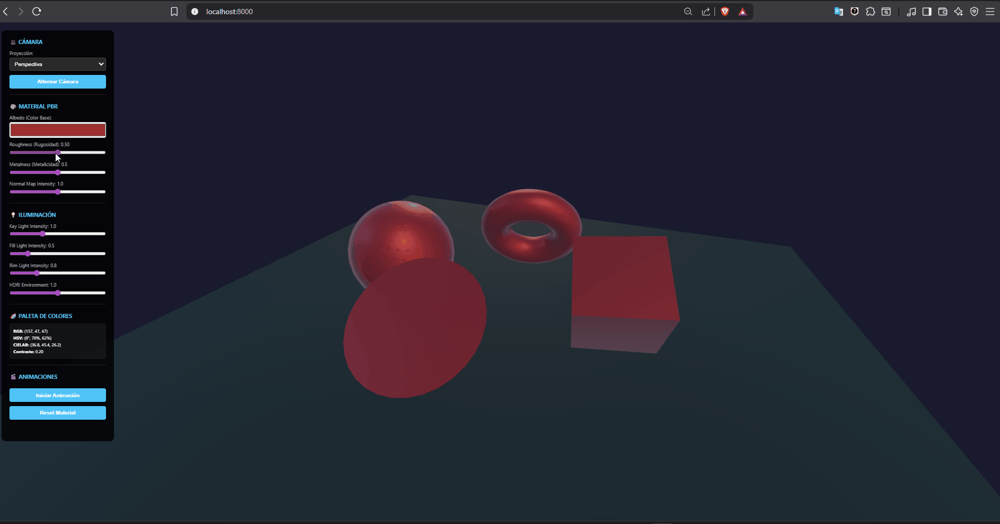
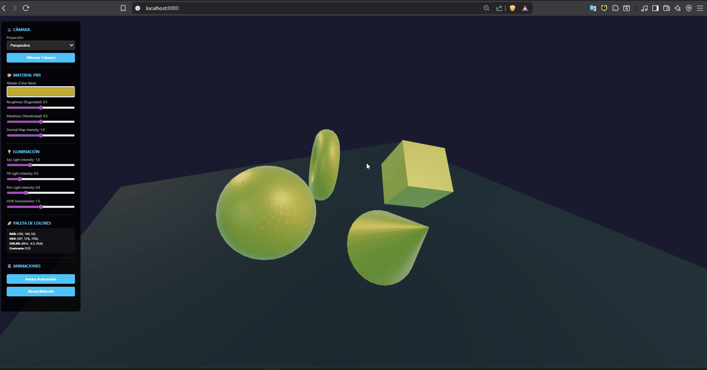
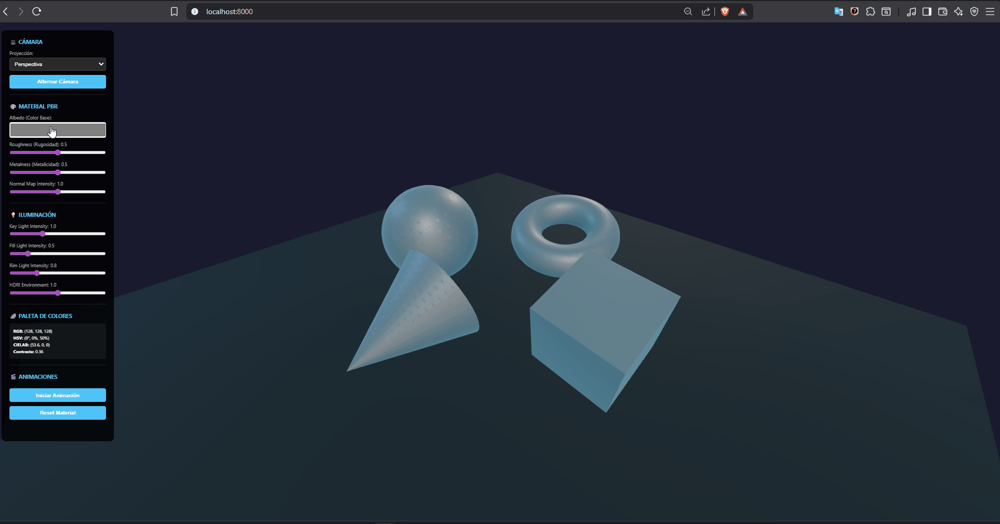
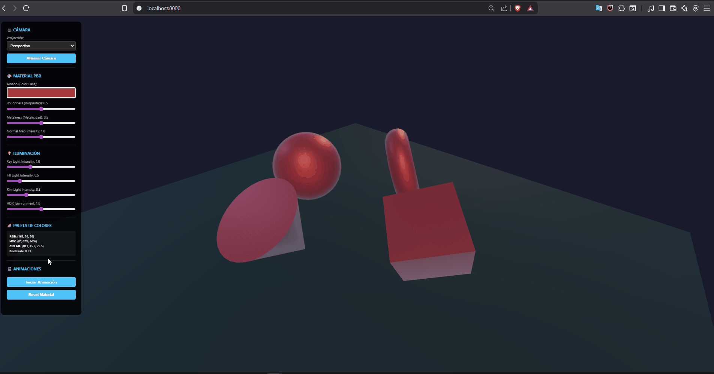

# Ejercicio 1: Materiales PBR, Luz y Color

## Descripción

Este ejercicio implementa un sistema completo de materiales PBR (Physically Based Rendering) con iluminación múltiple, control de cámaras y análisis de color en diferentes espacios cromáticos (RGB, HSV, CIELAB).

### ✅ Escena completa:


## Características Implementadas

### ✅ Materiales PBR



- **Albedo (Color Base)**: Control del color base del material mediante selector de color
- **Roughness (Rugosidad)**: Control de la rugosidad de la superficie (0 = espejo, 1 = mate)
- **Metalness (Metalicidad)**: Control del comportamiento metálico del material (0 = dieléctrico, 1 = conductor)
- **Normal Map**: Mapa normal procedural generado dinámicamente para agregar detalle de superficie

### ✅ Iluminación Múltiple


- **Key Light**: Luz principal direccional desde el frente-derecha
- **Fill Light**: Luz suave de relleno desde la izquierda (color azulado)
- **Rim Light**: Luz de borde desde atrás para definir siluetas (color cálido)
- **HDRI Environment**: Mapa de entorno procedural para reflexiones realistas

### ✅ Cámaras



- **Perspectiva**: Proyección con punto de fuga (perspectiva natural)
- **Ortográfica**: Proyección paralela sin distorsión de perspectiva
- **Alternancia**: Botón para cambiar entre ambos tipos de proyección
- **Controles Orbit**: Rotación, zoom y pan con mouse/touch

### ✅ Paleta de Colores y Espacios Cromáticos



- **RGB**: Valores Red, Green, Blue (0-255)
- **HSV**: Hue (matiz), Saturation (saturación), Value (brillo)
- **CIELAB**: Espacio de color perceptualmente uniforme (L*, a*, b*)
- **Cálculo de Contraste**: Comparación con fondo usando diferencias en CIELAB

### ✅ Animaciones



- Rotación continua de objetos 3D
- Animación de propiedades de material (roughness, metalness)
- Animación de intensidades de luz (key, fill, rim)
- Modo de animación activable/desactivable

## Uso

### Ejecución Local

1. Abre `index.html` en un navegador moderno que soporte ES modules
2. O usa un servidor local:

```bash
# Con Python
python -m http.server 8000

# Con Node.js
npx http-server
```

3. Navega a `http://localhost:8000`

### Controles

- **Mouse/Touch**: Rotar, hacer zoom y pan en la escena
- **Panel de Control**: Ajustar materiales, iluminación y cámaras en tiempo real
- **Botón "Iniciar Animación"**: Activa animaciones automáticas de materiales y luz
- **Botón "Alternar Cámara"**: Cambia entre perspectiva y ortográfica

## Estructura del Código

```
punto_1/
├── index.html          # Interfaz HTML con controles
├── main.js             # Lógica principal de Three.js
└── README.md           # Este archivo
```

## Tecnologías Utilizadas

- **Three.js v0.160.0**: Librería 3D WebGL
- **ES6 Modules**: Importación moderna de módulos
- **Vanilla JavaScript**: Sin frameworks adicionales

## Detalles Técnicos

### Generación de Normal Map

El mapa normal se genera proceduralmente usando un patrón de ondas sinusoidales que crea variación en la superficie. Esto permite visualizar el efecto del normal map sin necesidad de texturas externas.

### Conversión CIELAB

La conversión RGB → XYZ → CIELAB implementa:
1. Corrección gamma (sRGB)
2. Matriz de transformación sRGB → XYZ
3. Transformación no lineal XYZ → CIELAB usando función f(t)

### Material PBR

El material usa `MeshStandardMaterial` de Three.js que implementa:
- Modelo de iluminación Cook-Torrance
- Fresnel reflections
- Energy conservation
- Metallic workflow

## Evidencias Visuales

Para capturar evidencias:
1. Usa los controles para crear diferentes configuraciones de material
2. Alterna entre cámaras para mostrar diferentes proyecciones
3. Activa la animación para capturar variaciones dinámicas
4. Prueba diferentes colores y observa los valores en RGB/HSV/CIELAB

## Referencias

- [Three.js Documentation](https://threejs.org/docs/)
- [PBR Theory](https://learnopengl.com/PBR/Theory)
- [CIELAB Color Space](https://en.wikipedia.org/wiki/CIELAB_color_space)
