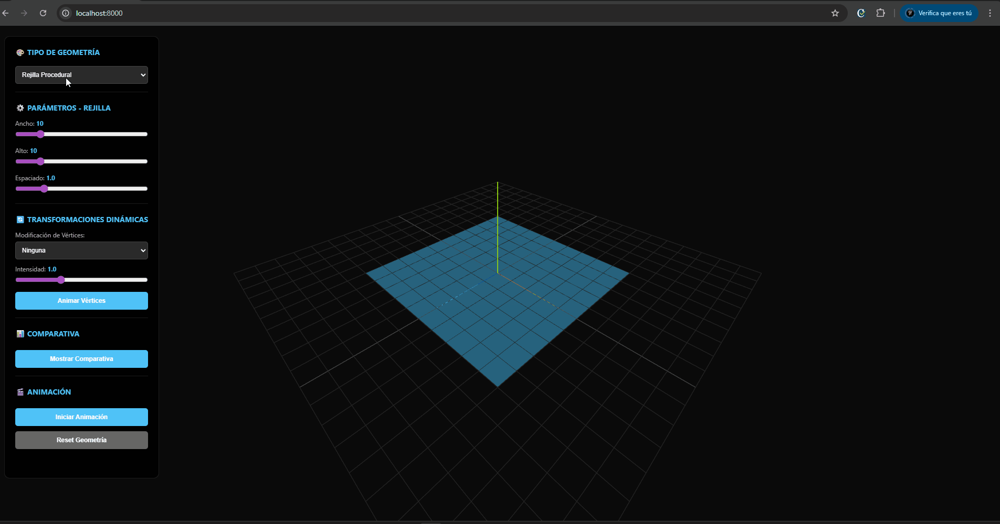
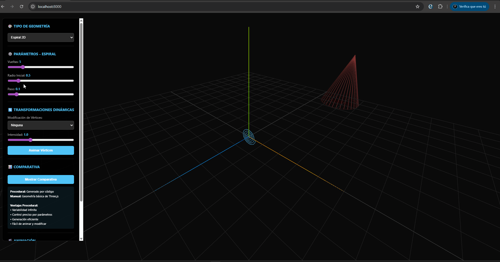
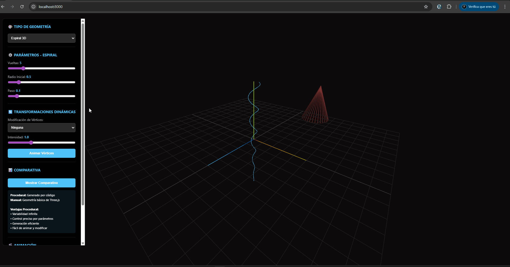
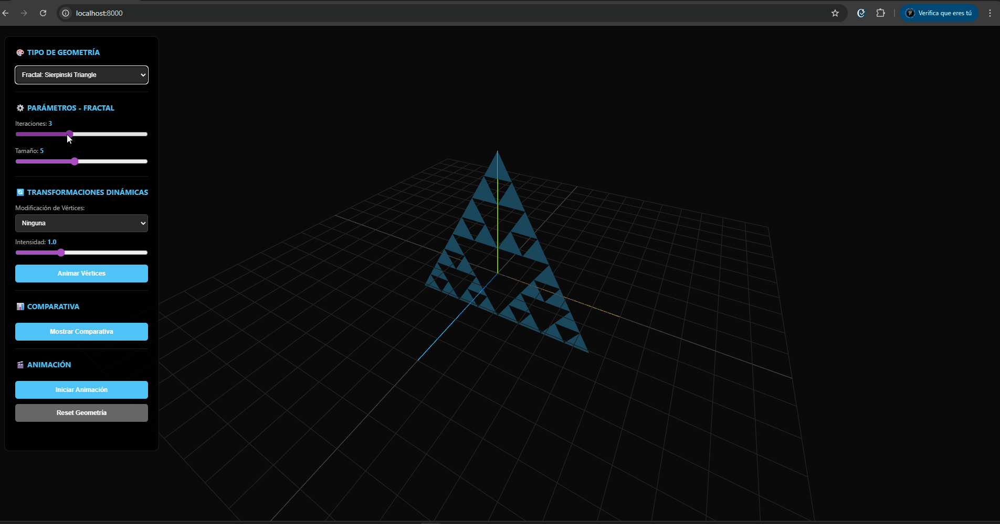
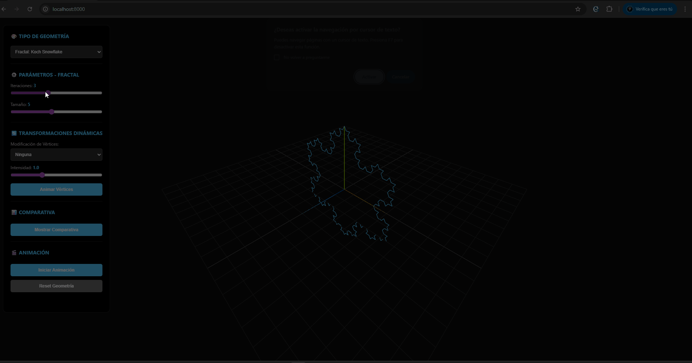
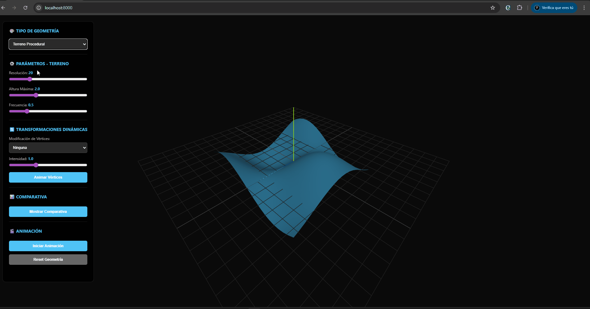
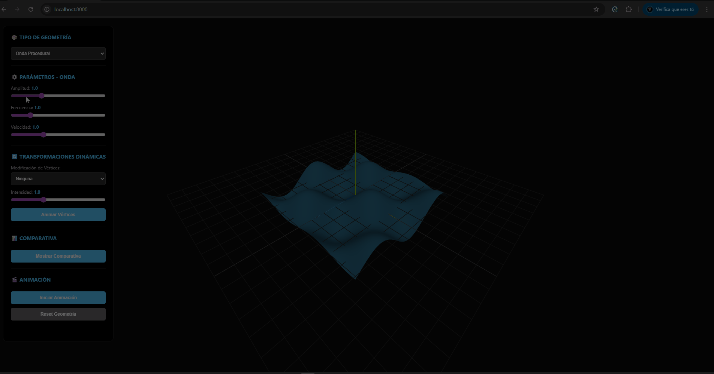

# Ejercicio 2: Modelado Procedural desde Código

## Descripción

Este ejercicio demuestra la generación de geometría 3D mediante algoritmos procedurales, mostrando diferentes técnicas de modelado por código incluyendo rejillas, espirales, fractales, terrenos y modificaciones dinámicas de vértices.

## Características Implementadas


### ✅ Generación de Geometría por Algoritmos

#### Rejilla Procedural



- Generación de mallas cuadriculadas mediante bucles anidados
- Control de ancho, alto y espaciado
- Comparación con geometría manual (PlaneGeometry)

#### Espirales



- **Espiral 2D**: Generación mediante coordenadas polares



- **Espiral 3D**: Extensión tridimensional con altura variable
- Control de vueltas, radio inicial y paso angular

#### Fractales Simples



- **Triángulo de Sierpinski**: Implementación recursiva del fractal clásico



- **Copo de Nieve de Koch**: Generación de curva fractal mediante subdivisión recursiva
- Control de iteraciones y tamaño

#### Terreno Procedural



- Generación de superficies mediante funciones de ruido
- Control de resolución, altura máxima y frecuencia
- Cálculo automático de normales para iluminación

#### Onda Procedural



- Superficie animada mediante funciones trigonométricas
- Control de amplitud, frecuencia y velocidad de animación

### ✅ Bucles y Recursión para Patrones Espaciales

- **Bucles anidados**: Utilizados en rejillas, terrenos y ondas
- **Recursión**: Implementada en fractales (Sierpinski, Koch)
- **Patrones iterativos**: Generación de espirales mediante bucles

### ✅ Modificación de Vértices/Transformaciones Dinámicas

- **Ruido (Noise)**: Modificación aleatoria de vértices
- **Ondas**: Deformación mediante funciones seno/coseno
- **Torsión (Twist)**: Rotación de vértices alrededor del eje Y
- **Curvatura (Bend)**: Deformación mediante función seno
- Control de intensidad para todas las transformaciones
- Animación en tiempo real de modificaciones

### ✅ Comparativa: Modelado por Código vs Modelado Manual

- Visualización lado a lado de geometría procedural vs manual
- Demostración de ventajas del modelado procedural:
  - Variabilidad infinita mediante parámetros
  - Control preciso de cada aspecto
  - Generación eficiente
  - Fácil animación y modificación

## Uso

### Ejecución Local

1. Abre `index.html` en un navegador moderno que soporte ES modules
2. O usa un servidor local:

```bash
# Con Python
python -m http.server 8000

# Con Node.js
npx http-server
```

3. Navega a `http://localhost:8000`

### Controles

- **Selector de Tipo**: Cambia entre diferentes tipos de geometría procedural
- **Parámetros**: Ajusta los valores específicos de cada tipo de geometría
- **Transformaciones**: Aplica modificaciones dinámicas a los vértices
- **Comparativa**: Muestra geometría procedural vs manual
- **Animación**: Activa rotación y animación de vértices

## Estructura del Código

```
ejercicio_2_procedural/
├── index.html          # Interfaz HTML con controles
├── main.js             # Lógica principal
│   ├── ProceduralGeometry  # Clase con generadores de geometría
│   ├── VertexModifier     # Clase para modificaciones de vértices
│   └── ProceduralScene    # Clase principal de la aplicación
└── README.md           # Este archivo
```

## Detalles Técnicos

### Generación de Rejillas

```javascript
// Bucles anidados para generar vértices
for (let z = 0; z <= height; z++) {
    for (let x = 0; x <= width; x++) {
        vertices.push((x - width/2) * spacing, 0, (z - height/2) * spacing);
    }
}
```

### Recursión en Fractales

```javascript
// Ejemplo: Sierpinski Triangle
function subdivideTriangle(p1, p2, p3, depth) {
    if (depth === 0) {
        // Base case: agregar triángulo
        return;
    }
    // Recursión: subdividir en 3 triángulos más pequeños
    subdivideTriangle(p1, m1, m3, depth - 1);
    subdivideTriangle(m1, p2, m2, depth - 1);
    subdivideTriangle(m3, m2, p3, depth - 1);
}
```

### Modificación de Vértices

```javascript
// Ejemplo: Aplicar torsión
for (let i = 0; i < positions.count; i++) {
    const angle = y * intensity;
    const newX = x * cos(angle) - z * sin(angle);
    const newZ = x * sin(angle) + z * cos(angle);
}
```

## Comparativa: Procedural vs Manual

### Ventajas del Modelado Procedural

1. **Variabilidad**: Infinitas variaciones mediante parámetros
2. **Control**: Control preciso de cada aspecto de la geometría
3. **Eficiencia**: Generación eficiente de geometría compleja
4. **Animación**: Fácil animación y modificación dinámica
5. **Escalabilidad**: Adaptable a diferentes resoluciones

### Ventajas del Modelado Manual

1. **Simplicidad**: Más fácil para formas básicas
2. **Precisión**: Control exacto para formas específicas
3. **Rendimiento**: Puede ser más rápido para geometría estática simple

## Ejemplos de Uso

### Generar Rejilla Personalizada
1. Selecciona "Rejilla Procedural"
2. Ajusta ancho, alto y espaciado
3. Observa la geometría generarse en tiempo real

### Crear Espiral 3D
1. Selecciona "Espiral 3D"
2. Ajusta vueltas, radio y paso
3. Activa animación para ver rotación

### Explorar Fractales
1. Selecciona "Fractal: Sierpinski Triangle" o "Koch Snowflake"
2. Aumenta iteraciones para ver más detalle
3. Observa cómo la recursión crea patrones complejos

### Modificar Vértices
1. Selecciona cualquier geometría
2. Elige tipo de modificación (ruido, ondas, torsión, curvatura)
3. Ajusta intensidad
4. Activa animación de vértices para ver cambios dinámicos

## Tecnologías Utilizadas

- **Three.js v0.160.0**: Librería 3D WebGL
- **ES6 Modules**: Importación moderna de módulos
- **Vanilla JavaScript**: Sin frameworks adicionales

## Referencias

- [Three.js Documentation](https://threejs.org/docs/)
- [Fractal Geometry](https://en.wikipedia.org/wiki/Fractal)
- [Procedural Generation](https://en.wikipedia.org/wiki/Procedural_generation)

