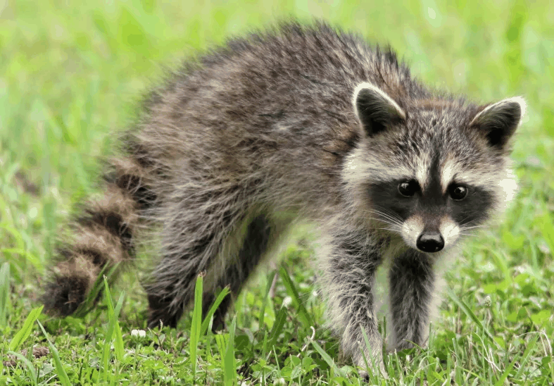

# Examen Final – Computación Visual

Este repositorio contiene la solución completa del examen final, dividida en dos puntos principales:

## 📁 Estructura del Proyecto

```
examen_final/
├── python/
│   ├── examen_final_python.ipynb
│   ├── data/
│   │   └── animal.webp
│   └── gifs/
├── threejs/
│   ├── index.html
│   ├── main.js
│   ├── textures/
│   └── gifs/
└── README.md (este archivo)
```

---

## Punto 1 – Python

### Descripción del Enfoque

Este punto implementa procesamiento de imágenes sobre una imagen RGB de un mapache (animal en vía de extinción). El enfoque utilizado incluye:

1. **Carga y visualización**: Se carga la imagen usando OpenCV y PIL (para compatibilidad con formato WebP), convirtiéndola a RGB para visualización correcta.

2. **Filtros básicos**:
   - **Suavizado (Gaussian Blur)**: Se aplica un filtro gaussiano con kernel 15x15 para reducir ruido y suavizar la imagen.
   - **Realce de bordes (Laplacian)**: Se utiliza el operador Laplaciano para detectar y realzar los bordes, combinándolo con la imagen original mediante una suma ponderada.

3. **Canales de color**: Se separan los canales R, G, B y se visualizan individualmente en escala de grises para analizar la información que aporta cada uno.

4. **Operaciones morfológicas**: Se trabaja sobre una versión binarizada (umbral adaptativo) de la imagen en escala de grises, aplicando:
   - **Erosión**: Reduce el tamaño de objetos blancos, eliminando ruido pequeño.
   - **Dilatación**: Aumenta el tamaño de objetos blancos, rellenando huecos.

5. **Animación GIF**: Se genera un GIF que muestra secuencialmente la imagen original, los filtros aplicados y las operaciones morfológicas.

### Resultados



*GIF mostrando: Imagen Original → Suavizado → Realce de Bordes → Binarizada → Erosión → Dilatación*

---

## Punto 2 – Three.js

### Descripción de la Escena

Se creó una escena 3D equilibrada con múltiples formas geométricas básicas organizadas como una composición visual. La escena incluye:

- **Formas geométricas**: Cubo, esfera, cilindro, cono y torus (dona), todas posicionadas de manera equilibrada sobre un plano base.
- **Texturas programáticas**: Dos texturas diferentes generadas programáticamente:
  - Textura de cuadrícula azul para el plano del piso.
  - Textura de círculos concéntricos con gradiente de colores para los objetos 3D.
- **Iluminación**: Dos luces principales:
  - Luz direccional (simulando luz solar) con sombras.
  - Luz puntual azul para ambiente adicional.
- **Animaciones continuas**:
  - Cubo: Rotación en X e Y.
  - Esfera: Rotación en X y Z.
  - Cilindro: Traslación vertical (sube y baja) + rotación.
  - Cono: Rotación + traslación horizontal.
  - Torus: Rotación en múltiples ejes + traslación vertical.

### Interacción

- **OrbitControls**: Permite rotar la cámara alrededor de la escena, hacer zoom y pan.
- **Cambio de perspectiva**: Botón para alternar entre:
  - **Perspectiva frontal**: Vista desde el frente de la escena.
  - **Perspectiva superior**: Vista desde arriba (top-down).

### Resultados


*Vista frontal de la escena con todas las formas animadas*


*Vista superior mostrando la composición desde arriba*


*Demostración de las animaciones y el uso de OrbitControls*


*Demostracion de animaciones*

### Implementación Técnica

**Cambio de perspectiva**: Se implementó mediante dos configuraciones de posición de cámara predefinidas. Al hacer clic en el botón, la cámara se mueve suavemente a la nueva posición usando OrbitControls.

**Animaciones**: Se implementaron en el bucle de render usando `requestAnimationFrame`. Las animaciones combinan rotación y traslación usando funciones trigonométricas (`sin`, `cos`) para crear movimientos suaves y continuos.

**Texturas**: Se generan programáticamente usando el Canvas API de HTML5, creando patrones visuales atractivos sin necesidad de archivos externos. Las texturas se aplican a los materiales usando `MeshStandardMaterial` con propiedades de roughness y metalness para un aspecto PBR.

**OrbitControls**: Se integró desde el módulo de ejemplos de Three.js, configurando límites de distancia (zoom) y habilitando damping para movimientos suaves.

---

## Instrucciones de Ejecución

### Punto 1 – Python

1. **Requisitos**:
   ```bash
   pip install opencv-python numpy matplotlib pillow imageio jupyter
   ```

2. **Ejecutar el notebook**:
   ```bash
   cd python
   jupyter notebook examen_final_python.ipynb
   ```

3. **Ejecutar todas las celdas**: El notebook generará automáticamente el GIF en la carpeta `gifs/`.

### Punto 2 – Three.js

1. **Servidor local**: Debido a las restricciones CORS, es necesario usar un servidor HTTP local. Opciones:

   **Opción A - Python**:
   ```bash
   cd threejs
   python -m http.server 8000
   ```
   Luego abrir en el navegador: `http://localhost:8000`

   **Opción B - Node.js (http-server)**:
   ```bash
   npm install -g http-server
   cd threejs
   http-server -p 8000
   ```

2. **Abrir en el navegador**: Navegar a `http://localhost:8000`

3. **Controles**:
   - **Click + arrastrar**: Rotar cámara
   - **Rueda del mouse**: Zoom in/out
   - **Click derecho + arrastrar**: Pan
   - **Botón "Cambiar Perspectiva"**: Alternar entre vista frontal y superior

---

## Notas Técnicas

- El proyecto de Three.js usa ES6 modules con import maps desde CDN, sin necesidad de bundler.
- Las texturas se generan programáticamente para mantener el proyecto simple y autocontenido.
- El notebook de Python maneja tanto formatos estándar como WebP para máxima compatibilidad.

